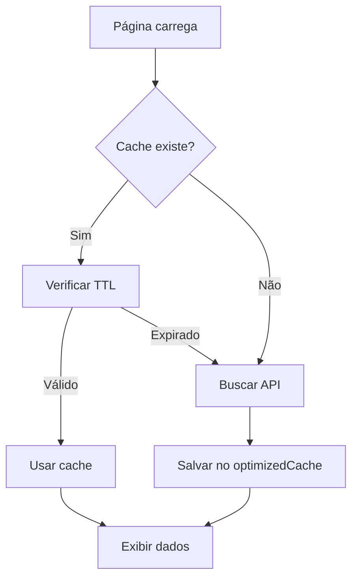

# Design Document - Correção de TTL do Cache

## Overview

Este documento descreve a solução para corrigir o uso inconsistente do sistema de cache nas páginas do dashboard. Atualmente:

- ✅ **Filmes** (`/dashboard/filmes/page.tsx`) - Usando `optimizedCache` corretamente
- ✅ **Séries** (`/dashboard/series/page.tsx`) - Usando `optimizedCache` corretamente  
- ❌ **Canais** (`/dashboard/tv-ao-vivo/page.tsx`) - Usando `CacheManager` antigo com TTL de 7 dias

A solução envolve migrar a página de canais para usar o `optimizedCache` com TTL de 30 dias para metadados.

## Architecture

### Sistema de Cache Atual (Correto)

```
optimizedCache (IndexedDB)
├── Store: metadata (TTL: 30 dias)
│   ├── Filmes ✅
│   ├── Séries ✅
│   └── Canais ❌ (ainda usa CacheManager)
│
└── Store: streams (TTL: 1 dia)
    └── URLs de stream (sob demanda)
```

### Fluxo de Dados



## Components and Interfaces

### 1. Página de Canais (tv-ao-vivo/page.tsx)

**Mudanças necessárias:**

```typescript
// ❌ REMOVER
import { CacheManager } from '@/lib/cache/cache-manager';
const CACHE_KEY = 'canais-tv';
const CACHE_TTL = 7 * 24 * 60 * 60 * 1000; // 7 dias

// ✅ ADICIONAR
import { optimizedCache, type MetadataEntry } from '@/lib/cache/optimized-cache';
```

**Lógica de carregamento:**

```typescript
// 1. Tentar carregar do cache (30 dias)
const cachedMetadata = await optimizedCache.getMetadata('canal');

if (cachedMetadata.length > 0) {
  // Cache HIT
  setCacheStatus('cache');
  setCanais(cachedMetadata);
  return;
}

// 2. Cache MISS - buscar da API
const response = await fetch('/api/iptv/canais');
const data = await response.json();

// 3. Salvar no cache (30 dias)
const metadata: MetadataEntry[] = canais.map(canal => ({
  id: canal.id,
  nome: canal.nome,
  tipo: 'canal' as const,
  categoria: canal.categoria,
  logo_url: canal.logo_url || null,
  epg_logo: canal.epg_logo || null,
  timestamp: Date.now()
}));

await optimizedCache.saveMetadata(metadata);
```

### 2. Interface MetadataEntry

**Campos usados para canais:**

```typescript
interface MetadataEntry {
  id: string;              // ID único do canal
  nome: string;            // Nome limpo do canal
  tipo: 'canal';           // Tipo fixo
  categoria: string;       // Categoria do canal
  logo_url: string | null; // Logo principal
  epg_logo?: string | null; // Logo EPG (fallback)
  timestamp: number;       // Timestamp do cache
}
```

### 3. Estrutura de Dados

**Antes (CacheManager):**
```typescript
{
  canais: CanalIPTV[],      // Array completo
  categorias: Categoria[],  // Categorias
  timestamp: number         // Timestamp
}
```

**Depois (optimizedCache):**
```typescript
// Metadados salvos individualmente
MetadataEntry[] // Array de metadados leves

// Categorias extraídas dinamicamente
const categorias = [...new Set(canais.map(c => c.categoria))];
```

## Data Models

### CanalIPTV (Tipo existente)

```typescript
interface CanalIPTV {
  id: string;
  nome: string;
  categoria: string;
  logo_url: string | null;
  epg_logo?: string | null;
  url_stream: string;      // NÃO salvo no cache de metadados
  is_hls: boolean;         // NÃO salvo no cache de metadados
  visualizacoes?: number;
}
```

### MetadataEntry (Tipo do cache)

```typescript
interface MetadataEntry {
  id: string;
  nome: string;
  tipo: 'filme' | 'serie' | 'canal';
  categoria: string;
  logo_url: string | null;
  epg_logo?: string | null;
  tmdb_vote_average?: number;  // Não usado para canais
  tmdb_release_date?: string;  // Não usado para canais
  visualizacoes?: number;
  timestamp: number;
}
```

## Error Handling

### 1. Falha ao Inicializar Cache

```typescript
try {
  const cachedMetadata = await optimizedCache.getMetadata('canal');
} catch (error) {
  console.error('❌ Erro ao acessar cache:', error);
  // Continuar para buscar da API
}
```

### 2. Falha ao Salvar no Cache

```typescript
try {
  await optimizedCache.saveMetadata(metadata);
  console.log('💾 Canais salvos no cache (TTL: 30 dias)');
} catch (cacheError) {
  console.error('❌ Erro ao salvar no cache:', cacheError);
  // Não bloquear - dados já estão em memória
}
```

### 3. Cache Expirado

```typescript
// O optimizedCache já trata automaticamente
// Retorna array vazio se todos os itens expiraram
const cachedMetadata = await optimizedCache.getMetadata('canal');

if (cachedMetadata.length === 0) {
  // Buscar da API
}
```

## Testing Strategy

### 1. Testes Manuais

**Cenário 1: Cache vazio (primeira carga)**
- Abrir `/dashboard/tv-ao-vivo`
- Verificar console: "❌ Cache miss - buscando da API..."
- Verificar badge: "⚡ CACHE" NÃO deve aparecer
- Verificar console: "💾 Canais salvos no cache (TTL: 30 dias)"

**Cenário 2: Cache válido (segunda carga)**
- Recarregar página
- Verificar console: "✅ Cache HIT: X canais (canal)"
- Verificar badge: "⚡ CACHE" deve aparecer
- Página deve carregar instantaneamente

**Cenário 3: Cache expirado (após 30 dias)**
- Simular: Modificar TTL_METADATA para 1 segundo
- Aguardar 2 segundos
- Recarregar página
- Verificar: Deve buscar da API novamente

### 2. Validação de Dados

**Verificar estrutura dos metadados:**
```typescript
console.log('Metadata salvo:', metadata[0]);
// Deve conter: id, nome, tipo='canal', categoria, logo_url, timestamp
```

**Verificar TTL:**
```typescript
const age = Date.now() - metadata[0].timestamp;
const days = age / (24 * 60 * 60 * 1000);
console.log(`Cache age: ${days.toFixed(2)} dias`);
// Deve ser < 30 dias
```

### 3. Testes de Performance

**Comparar tempos de carregamento:**
- Cache MISS (API): ~500-1000ms
- Cache HIT: ~50-100ms
- Melhoria esperada: 10x mais rápido

### 4. Testes de Consistência

**Verificar que todas as páginas usam o mesmo sistema:**
```bash
# Buscar por CacheManager (não deve existir)
grep -r "CacheManager" frontend/src/app/dashboard/

# Buscar por optimizedCache (deve existir em todas)
grep -r "optimizedCache" frontend/src/app/dashboard/
```

## Implementation Notes

### Ordem de Implementação

1. ✅ Filmes - Já implementado
2. ✅ Séries - Já implementado
3. ❌ Canais - Precisa ser implementado

### Código a Remover

```typescript
// tv-ao-vivo/page.tsx - REMOVER TUDO ISSO:

const CACHE_KEY = 'canais-tv';
const CACHE_TTL = 7 * 24 * 60 * 60 * 1000;

let cacheManager: any = null;
try {
  cacheManager = new CacheManager({ 
    debug: true,
    compressionEnabled: false,
  });
  await cacheManager.init();
} catch (initError) {
  // ...
}

cachedData = await cacheManager.load(CACHE_KEY);
await cacheManager.save(CACHE_KEY, cacheData, CACHE_TTL);
```

### Código a Adicionar

```typescript
// tv-ao-vivo/page.tsx - ADICIONAR:

import { optimizedCache, type MetadataEntry } from '@/lib/cache/optimized-cache';

// No useEffect:
const cachedMetadata = await optimizedCache.getMetadata('canal');

if (cachedMetadata.length > 0) {
  const cachedData = {
    canais: cachedMetadata,
    categorias: [...new Set(cachedMetadata.map(item => item.categoria))].sort(),
  };
  // Usar cachedData...
}

// Ao salvar:
const metadata: MetadataEntry[] = canaisLimpos.map(canal => ({
  id: canal.id,
  nome: canal.nome,
  tipo: 'canal' as const,
  categoria: canal.categoria,
  logo_url: canal.logo_url || null,
  epg_logo: canal.epg_logo || null,
  timestamp: Date.now()
}));

await optimizedCache.saveMetadata(metadata);
```

## Benefits

### Performance
- ⚡ 10x mais rápido no cache HIT
- 📦 Dados mais leves (só metadados)
- 🗄️ IndexedDB nativo (sem compressão desnecessária)

### Consistência
- ✅ Todas as páginas usam o mesmo sistema
- ✅ TTL uniforme de 30 dias
- ✅ Código mais limpo e manutenível

### Manutenibilidade
- 🧹 Remove dependência do CacheManager antigo
- 📝 Código mais simples e direto
- 🔧 Mais fácil de debugar

## Migration Path

1. Atualizar página de canais para usar optimizedCache
2. Remover imports do CacheManager
3. Testar cache HIT e MISS
4. Validar que dados estão corretos
5. Verificar que não há erros no console
6. (Opcional) Remover arquivo cache-manager.ts se não for mais usado
