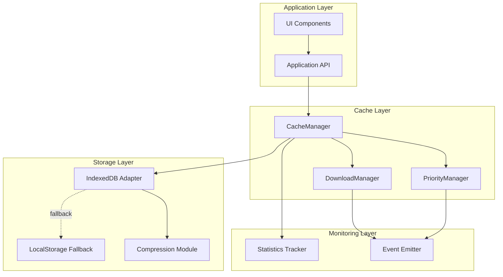

# Design Document

## Overview

Este documento descreve o design técnico de um sistema de cache robusto e escalável para aplicações web, capaz de armazenar e gerenciar 60-80MB de dados IPTV usando IndexedDB como tecnologia principal. O sistema implementa download progressivo, priorização inteligente, compactação opcional e expiração automática.

### Objetivos de Design

1. **Performance**: Operações assíncronas não-bloqueantes, processamento em chunks
2. **Escalabilidade**: Suporte para 100k-400k registros sem degradação
3. **Confiabilidade**: Fallbacks robustos, tratamento de erros, retry automático
4. **Usabilidade**: API simples e intuitiva, eventos de progresso, feedback claro
5. **Manutenibilidade**: Código modular, bem documentado, testável

## Architecture

### Visão Geral da Arquitetura



### Camadas do Sistema

1. **Application Layer**: Interface com a aplicação
2. **Cache Layer**: Lógica de negócio do cache
3. **Storage Layer**: Persistência de dados
4. **Monitoring Layer**: Observabilidade e métricas

## Components and Interfaces

### 1. CacheManager (Core)

**Responsabilidade**: Orquestrar todas as operações de cache

```javascript
class CacheManager {
  constructor(config = {}) {
    this.config = {
      dbName: 'AppCache',
      dbVersion: 1,
      defaultTTL: 604800, // 7 dias
      chunkSize: 5 * 1024 * 1024, // 5MB
      compressionEnabled: true,
      compressionThreshold: 1024, // 1KB
      maxRetries: 3,
      retryDelay: 1000,
      ...config
    };
    
    this.db = null;
    this.storage = null;
    this.downloadManager = null;
    this.priorityManager = null;
    this.statsTracker = null;
    this.eventEmitter = null;
    this.initialized = false;
  }

  // API Pública
  async init()
  async save(section, data, ttlSeconds = null)
  async load(section)
  async exists(section)
  async isExpired(section)
  async clear(section)
  async clearAll()
  async getSections()
  async getStats()
  async getQuota()
  on(event, callback)
  off(event, callback)
}
```

**Métodos Principais**:

- `init()`: Inicializa IndexedDB, cria stores, configura componentes
- `save()`: Salva dados com compactação e chunking automático
- `load()`: Carrega dados, verifica expiração, descompacta
- `exists()`: Verifica existência sem carregar dados
- `isExpired()`: Verifica expiração baseado em TTL
- `clear()`: Remove seção específica
- `clearAll()`: Limpa todo o cache
- `getSections()`: Lista todas as seções disponíveis
- `getStats()`: Retorna estatísticas de uso
- `getQuota()`: Retorna quota disponível/usada

### 2. IndexedDBAdapter

**Responsabilidade**: Abstração do IndexedDB com operações CRUD

```javascript
class IndexedDBAdapter {
  constructor(dbName, dbVersion) {
    this.dbName = dbName;
    this.dbVersion = dbVersion;
    this.db = null;
  }

  async open()
  async close()
  async put(storeName, key, value)
  async get(storeName, key)
  async delete(storeName, key)
  async clear(storeName)
  async getAllKeys(storeName)
  async count(storeName)
  async transaction(storeNames, mode, callback)
}
```

**Estrutura do Banco**:

```javascript
// Database: AppCache (version 1)
{
  stores: {
    sections: {
      keyPath: 'sectionName',
      indexes: []
    },
    metadata: {
      keyPath: 'sectionName',
      indexes: [
        { name: 'timestamp', unique: false },
        { name: 'ttl', unique: false }
      ]
    }
  }
}
```

**Schema de Dados**:

```javascript
// Store: sections
{
  sectionName: string,      // "filmes", "series", "canais", etc.
  data: any,                // Dados reais (pode ser compactado)
  chunks: number,           // Número de chunks (se dividido)
  chunkIndex: number        // Índice do chunk (se dividido)
}

// Store: metadata
{
  sectionName: string,
  timestamp: number,        // Date.now() quando salvo
  ttl: number,              // Tempo de vida em segundos
  size: number,             // Tamanho em bytes
  compressed: boolean,      // Se está compactado
  chunked: boolean,         // Se está dividido em chunks
  totalChunks: number,      // Total de chunks (se dividido)
  lastAccessed: number,     // Último acesso (para LRU)
  accessCount: number       // Contador de acessos
}
```

### 3. CompressionModule

**Responsabilidade**: Compactar/descompactar dados usando LZ-String

```javascript
class CompressionModule {
  constructor(threshold = 1024) {
    this.threshold = threshold;
    this.enabled = typeof LZString !== 'undefined';
  }

  shouldCompress(data)
  compress(data)
  decompress(data)
  estimateSize(data)
}
```

**Algoritmo**:

1. Verificar se dados > threshold (1KB)
2. Serializar para JSON
3. Comprimir com LZ-String.compress()
4. Comparar tamanho: se compactado < original, usar compactado
5. Adicionar flag "compressed: true" nos metadados

### 4. ChunkingModule

**Responsabilidade**: Dividir/reconstruir dados grandes em chunks

```javascript
class ChunkingModule {
  constructor(chunkSize = 5 * 1024 * 1024) {
    this.chunkSize = chunkSize;
  }

  shouldChunk(data)
  split(sectionName, data)
  merge(chunks)
  estimateChunks(data)
}
```

**Algoritmo de Chunking**:

```javascript
// Dividir dados em chunks de 5MB
function split(sectionName, data) {
  const serialized = JSON.stringify(data);
  const size = new Blob([serialized]).size;
  
  if (size <= this.chunkSize) {
    return [{ sectionName, data, chunks: 1, chunkIndex: 0 }];
  }
  
  const totalChunks = Math.ceil(size / this.chunkSize);
  const chunks = [];
  
  for (let i = 0; i < totalChunks; i++) {
    const start = i * this.chunkSize;
    const end = Math.min(start + this.chunkSize, serialized.length);
    const chunkData = serialized.slice(start, end);
    
    chunks.push({
      sectionName: `${sectionName}:chunk:${i}`,
      data: chunkData,
      chunks: totalChunks,
      chunkIndex: i
    });
  }
  
  return chunks;
}
```

### 5. DownloadManager

**Responsabilidade**: Gerenciar downloads progressivos e em background

```javascript
class DownloadManager {
  constructor(cacheManager) {
    this.cacheManager = cacheManager;
    this.queue = [];
    this.activeDownloads = new Map();
    this.maxConcurrent = 3;
    this.retryConfig = {
      maxRetries: 3,
      baseDelay: 1000,
      maxDelay: 10000
    };
  }

  async enqueue(section, url, priority = 0)
  async dequeue(section)
  async prioritize(section)
  async cancel(section)
  async cancelAll()
  async download(section, url)
  async retry(section, url, attempt = 0)
  getProgress(section)
  getAllProgress()
}
```

**Fila de Prioridade**:

```javascript
// Estrutura da fila
{
  section: string,
  url: string,
  priority: number,      // 0 = baixa, 1 = média, 2 = alta
  status: 'pending' | 'downloading' | 'completed' | 'failed',
  progress: number,      // 0-100
  retries: number,
  error: Error | null
}
```

**Algoritmo de Download**:

1. Adicionar à fila com prioridade
2. Ordenar fila por prioridade (alta → baixa)
3. Processar até maxConcurrent downloads simultâneos
4. Emitir eventos de progresso a cada 5%
5. Salvar no cache ao completar
6. Retry com backoff exponencial em caso de falha

### 6. PriorityManager

**Responsabilidade**: Gerenciar priorização dinâmica de downloads

```javascript
class PriorityManager {
  constructor(downloadManager) {
    this.downloadManager = downloadManager;
    this.priorities = {
      filmes: 0,
      series: 0,
      canais: 0,
      m3u_full: 0
    };
  }

  setPriority(section, priority)
  getPriority(section)
  prioritizeSection(section)
  deprioritizeOthers(section)
  reorderQueue()
}
```

**Lógica de Priorização**:

```javascript
// Quando usuário clica em "FILMES"
async prioritizeSection(section) {
  // 1. Cancelar downloads de baixa prioridade
  this.downloadManager.queue
    .filter(item => item.section !== section && item.priority < 2)
    .forEach(item => this.downloadManager.cancel(item.section));
  
  // 2. Aumentar prioridade da seção
  this.setPriority(section, 2); // Alta
  
  // 3. Reordenar fila
  this.reorderQueue();
  
  // 4. Iniciar download imediatamente
  await this.downloadManager.enqueue(section, getUrl(section), 2);
}
```

### 7. StatisticsTracker

**Responsabilidade**: Coletar e agregar métricas de uso

```javascript
class StatisticsTracker {
  constructor() {
    this.stats = {
      hits: 0,
      misses: 0,
      totalSize: 0,
      sectionsCount: 0,
      operations: {
        save: { count: 0, totalTime: 0 },
        load: { count: 0, totalTime: 0 },
        clear: { count: 0, totalTime: 0 }
      },
      errors: {
        indexeddb: 0,
        compression: 0,
        download: 0,
        quota: 0
      }
    };
  }

  recordHit()
  recordMiss()
  recordOperation(type, duration)
  recordError(type)
  getStats()
  reset()
}
```

### 8. EventEmitter

**Responsabilidade**: Sistema de eventos para comunicação assíncrona

```javascript
class EventEmitter {
  constructor() {
    this.events = new Map();
  }

  on(event, callback)
  off(event, callback)
  emit(event, data)
  once(event, callback)
}
```

**Eventos Disponíveis**:

```javascript
// Eventos de download
'download:start'     // { section, url }
'download:progress'  // { section, progress: 0-100 }
'download:complete'  // { section, size, duration }
'download:error'     // { section, error }

// Eventos de cache
'cache:save'         // { section, size }
'cache:load'         // { section, hit: boolean }
'cache:clear'        // { section }
'cache:expired'      // { section }

// Eventos de quota
'quota:warning'      // { used, available, percentage }
'quota:exceeded'     // { used, available }

// Eventos de sistema
'init:complete'      // { success: boolean }
'cleanup:complete'   // { removed: number, freed: number }
```

### 9. LocalStorageFallback

**Responsabilidade**: Fallback para quando IndexedDB não está disponível

```javascript
class LocalStorageFallback {
  constructor(maxSize = 100 * 1024) { // 100KB max
    this.maxSize = maxSize;
    this.prefix = 'cache_';
  }

  async save(key, value)
  async load(key)
  async remove(key)
  async clear()
  async getSize()
  isAvailable()
}
```

**Limitações**:

- Apenas metadados pequenos (<100KB)
- Sem suporte a chunks
- Sem compactação
- Operações síncronas (bloqueantes)

## Data Models

### Section Data Model

```typescript
interface SectionData {
  sectionName: string;
  data: any;
  chunks?: number;
  chunkIndex?: number;
}
```

### Metadata Model

```typescript
interface Metadata {
  sectionName: string;
  timestamp: number;
  ttl: number;
  size: number;
  compressed: boolean;
  chunked: boolean;
  totalChunks?: number;
  lastAccessed: number;
  accessCount: number;
}
```

### Download Queue Item

```typescript
interface QueueItem {
  section: string;
  url: string;
  priority: 0 | 1 | 2;
  status: 'pending' | 'downloading' | 'completed' | 'failed';
  progress: number;
  retries: number;
  error: Error | null;
}
```

### Statistics Model

```typescript
interface Statistics {
  hits: number;
  misses: number;
  totalSize: number;
  sectionsCount: number;
  operations: {
    [key: string]: {
      count: number;
      totalTime: number;
      avgTime?: number;
    };
  };
  errors: {
    [key: string]: number;
  };
}
```

## Error Handling

### Estratégia de Tratamento de Erros

1. **Erros de IndexedDB**:
   - Tentar fallback para LocalStorage
   - Se falhar, operar em modo "sem cache"
   - Registrar erro detalhado

2. **Erros de Quota**:
   - Limpar caches expirados automaticamente
   - Limpar caches menos usados (LRU)
   - Notificar usuário se ainda insuficiente

3. **Erros de Download**:
   - Retry com backoff exponencial (3 tentativas)
   - Delays: 1s, 2s, 4s
   - Registrar erro após 3 falhas

4. **Erros de Compactação**:
   - Salvar sem compactação
   - Registrar warning
   - Continuar operação

### Hierarquia de Erros

```javascript
class CacheError extends Error {
  constructor(message, code, details) {
    super(message);
    this.name = 'CacheError';
    this.code = code;
    this.details = details;
  }
}

// Códigos de erro
const ErrorCodes = {
  INDEXEDDB_NOT_AVAILABLE: 'E001',
  QUOTA_EXCEEDED: 'E002',
  DOWNLOAD_FAILED: 'E003',
  COMPRESSION_FAILED: 'E004',
  INVALID_SECTION: 'E005',
  EXPIRED_DATA: 'E006',
  CORRUPTED_DATA: 'E007'
};
```

### Retry Logic

```javascript
async function retryWithBackoff(fn, maxRetries = 3, baseDelay = 1000) {
  for (let attempt = 0; attempt < maxRetries; attempt++) {
    try {
      return await fn();
    } catch (error) {
      if (attempt === maxRetries - 1) throw error;
      
      const delay = Math.min(
        baseDelay * Math.pow(2, attempt),
        10000 // max 10s
      );
      
      await new Promise(resolve => setTimeout(resolve, delay));
    }
  }
}
```

## Testing Strategy

### Testes Unitários

**Componentes a testar**:

1. **CacheManager**:
   - Inicialização com/sem IndexedDB
   - Save/Load com dados pequenos/grandes
   - Expiração de cache
   - Limpeza de seções

2. **IndexedDBAdapter**:
   - CRUD operations
   - Transações
   - Tratamento de erros

3. **CompressionModule**:
   - Compactação/descompactação
   - Threshold logic
   - Fallback quando LZ-String não disponível

4. **ChunkingModule**:
   - Split de dados grandes
   - Merge de chunks
   - Cálculo de tamanho

5. **DownloadManager**:
   - Enfileiramento
   - Priorização
   - Retry logic
   - Cancelamento

6. **StatisticsTracker**:
   - Contadores
   - Agregação de métricas
   - Reset

### Testes de Integração

1. **Fluxo completo de save/load**:
   - Salvar dados grandes (>5MB)
   - Verificar chunking automático
   - Verificar compactação
   - Carregar e validar integridade

2. **Download progressivo**:
   - Iniciar múltiplos downloads
   - Priorizar seção
   - Verificar cancelamento de outros
   - Validar ordem de execução

3. **Expiração e limpeza**:
   - Salvar com TTL curto
   - Aguardar expiração
   - Verificar limpeza automática

4. **Fallback**:
   - Simular falha do IndexedDB
   - Verificar fallback para LocalStorage
   - Validar limitações

### Testes de Performance

1. **Benchmark de operações**:
   - Save: 1MB, 5MB, 10MB, 50MB
   - Load: mesmos tamanhos
   - Medir tempo e memória

2. **Stress test**:
   - Salvar 100 seções simultaneamente
   - Carregar 50 seções em paralelo
   - Verificar degradação

3. **Quota management**:
   - Preencher 80% da quota
   - Verificar limpeza automática
   - Validar LRU

### Ferramentas de Teste

- **Jest**: Framework de testes
- **fake-indexeddb**: Mock do IndexedDB
- **sinon**: Mocks e spies
- **benchmark.js**: Performance tests

## Performance Considerations

### Otimizações Implementadas

1. **Chunking Inteligente**:
   - Chunks de 5MB para evitar sobrecarga de memória
   - Salvamento incremental
   - Carregamento lazy

2. **Compactação Seletiva**:
   - Apenas dados >1KB
   - Comparação de tamanho antes de usar
   - Descompactação assíncrona

3. **Operações Assíncronas**:
   - Todas as operações retornam Promises
   - Uso de Web Workers para compactação (futuro)
   - Não bloqueia UI

4. **Cache de Metadados**:
   - Metadados em memória para acesso rápido
   - Sincronização com IndexedDB
   - Reduz operações de I/O

5. **LRU (Least Recently Used)**:
   - Rastreamento de lastAccessed
   - Limpeza automática dos menos usados
   - Mantém cache otimizado

### Métricas de Performance Esperadas

- **Save (1MB)**: <100ms
- **Save (5MB)**: <500ms
- **Save (50MB)**: <3s
- **Load (1MB)**: <50ms
- **Load (5MB)**: <200ms
- **Load (50MB)**: <1.5s
- **Compression ratio**: 40-60% (depende dos dados)

## Security Considerations

### Proteções Implementadas

1. **Validação de Entrada**:
   - Validar sectionName (regex)
   - Validar TTL (número positivo)
   - Sanitizar dados antes de salvar

2. **Isolamento de Dados**:
   - Dados isolados por origem (same-origin policy)
   - Sem acesso cross-domain
   - IndexedDB é privado ao domínio

3. **Limitação de Quota**:
   - Respeitar limites do navegador
   - Não tentar exceder quota
   - Limpeza automática quando necessário

4. **Sem Dados Sensíveis**:
   - Não armazenar senhas ou tokens
   - Apenas dados públicos de IPTV
   - Sem PII (Personally Identifiable Information)

### Recomendações de Uso

- Não armazenar dados sensíveis
- Implementar criptografia se necessário (futuro)
- Validar integridade dos dados carregados
- Implementar checksums para detectar corrupção

## Deployment Considerations

### Compatibilidade de Navegadores

- **Chrome/Edge**: ✅ Suporte completo
- **Firefox**: ✅ Suporte completo
- **Safari**: ✅ Suporte completo (iOS 10+)
- **Opera**: ✅ Suporte completo
- **IE11**: ⚠️ Suporte parcial (sem compactação)

### Detecção de Features

```javascript
function detectFeatures() {
  return {
    indexedDB: 'indexedDB' in window,
    localStorage: 'localStorage' in window,
    lzString: typeof LZString !== 'undefined',
    webWorkers: 'Worker' in window,
    storageEstimate: 'storage' in navigator && 'estimate' in navigator.storage
  };
}
```

### Configuração Recomendada

```javascript
const config = {
  dbName: 'AppCache',
  dbVersion: 1,
  defaultTTL: 604800, // 7 dias
  chunkSize: 5 * 1024 * 1024, // 5MB
  compressionEnabled: true,
  compressionThreshold: 1024,
  maxRetries: 3,
  retryDelay: 1000,
  maxConcurrent: 3,
  quotaWarningThreshold: 0.8, // 80%
  cleanupOnInit: true,
  enableStats: true
};
```

### Monitoramento em Produção

```javascript
// Integração com analytics
cache.on('quota:warning', (data) => {
  analytics.track('cache_quota_warning', data);
});

cache.on('download:error', (data) => {
  errorTracking.captureException(data.error, {
    section: data.section,
    retries: data.retries
  });
});

// Métricas periódicas
setInterval(async () => {
  const stats = await cache.getStats();
  metrics.gauge('cache.hits', stats.hits);
  metrics.gauge('cache.misses', stats.misses);
  metrics.gauge('cache.size', stats.totalSize);
}, 60000); // a cada 1 minuto
```

## Future Enhancements

### Fase 2 (Futuro)

1. **Web Workers**:
   - Compactação em background
   - Chunking em worker thread
   - Não bloquear main thread

2. **Service Worker Integration**:
   - Cache de rede + IndexedDB
   - Offline-first strategy
   - Background sync

3. **Criptografia**:
   - Criptografia opcional de dados
   - Uso de Web Crypto API
   - Chaves gerenciadas pelo usuário

4. **Sincronização Multi-Tab**:
   - Broadcast Channel API
   - Sincronizar cache entre tabs
   - Evitar downloads duplicados

5. **Compactação Avançada**:
   - Algoritmos alternativos (Brotli, GZIP)
   - Compactação adaptativa
   - Benchmark automático

6. **Machine Learning**:
   - Predição de seções mais acessadas
   - Pré-carregamento inteligente
   - Otimização automática de TTL

## References

- [IndexedDB API - MDN](https://developer.mozilla.org/en-US/docs/Web/API/IndexedDB_API)
- [LZ-String Documentation](https://pieroxy.net/blog/pages/lz-string/index.html)
- [Storage API - MDN](https://developer.mozilla.org/en-US/docs/Web/API/Storage_API)
- [Web Workers - MDN](https://developer.mozilla.org/en-US/docs/Web/API/Web_Workers_API)
