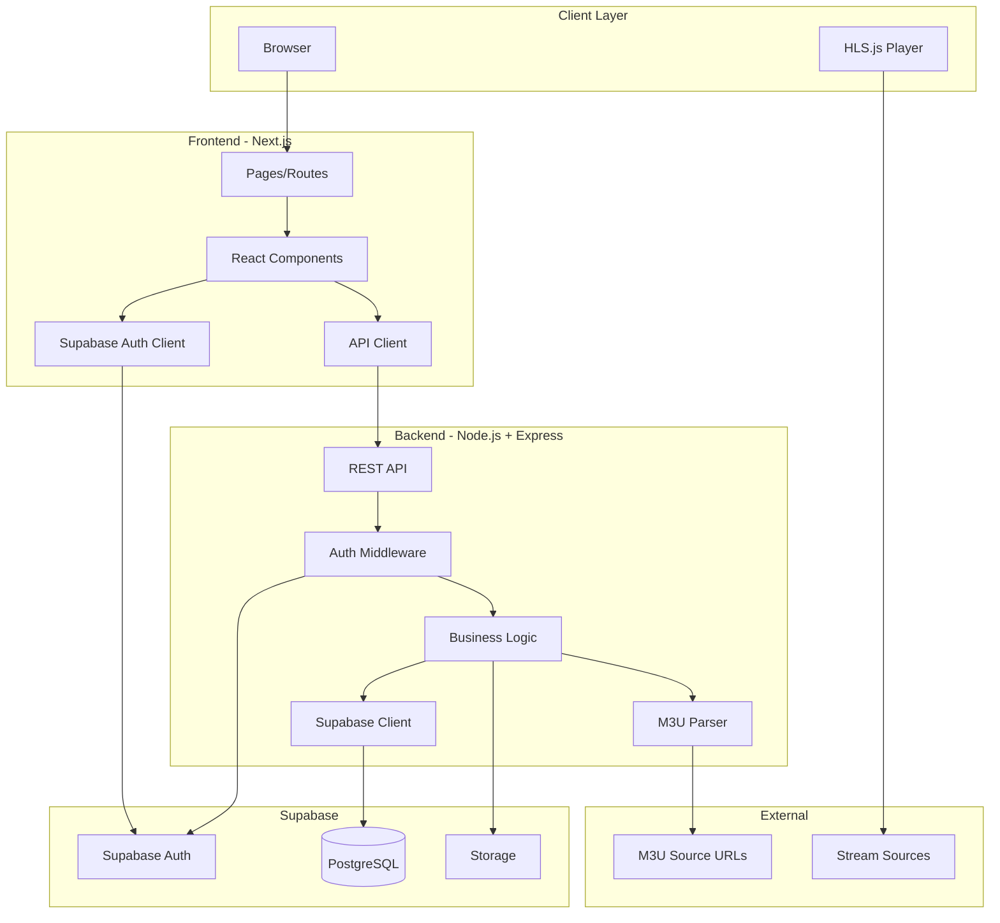

# Design - Plataforma de Streaming M3U

## Overview

A plataforma de streaming M3U é uma aplicação web full-stack que permite aos usuários gerenciar e reproduzir listas de canais no formato .m3u. A arquitetura segue o padrão de separação entre frontend e backend, com comunicação via API REST. O backend é construído em Node.js + TypeScript usando Express, enquanto o frontend utiliza Next.js com React. Supabase fornece autenticação, banco de dados PostgreSQL e storage.

### Princípios de Design

- **Separação de Responsabilidades**: Frontend e backend são aplicações independentes
- **Segurança em Primeiro Lugar**: Autenticação JWT, validação de inputs, rate limiting
- **Escalabilidade**: Processamento assíncrono, paginação, índices de banco otimizados
- **Experiência do Usuário**: Interface responsiva, feedback em tempo real, estados de loading
- **Manutenibilidade**: TypeScript, testes automatizados, código modular
- **Sem Proxy de Streams**: URLs de stream são consumidas diretamente pelo cliente

## Architecture

### High-Level Architecture



### Technology Stack

**Backend:**
- Runtime: Node.js 18+ LTS
- Language: TypeScript 5+
- Framework: Express.js 4.x
- Database Client: @supabase/supabase-js
- Parser: Custom M3U parser
- Validation: Zod
- Logging: Pino
- Testing: Jest + Supertest
- HTTP Client: Axios

**Frontend:**
- Framework: Next.js 14+ (App Router)
- Language: TypeScript 5+
- UI Library: React 18+
- Styling: Tailwind CSS 3+
- Auth: @supabase/auth-helpers-nextjs
- Player: hls.js
- HTTP Client: Fetch API
- State Management: React Context + Hooks
- Testing: Jest + React Testing Library + Playwright (E2E)

**Infrastructure:**
- Database/Auth: Supabase (PostgreSQL + Auth)
- Containerization: Docker + Docker Compose
- CI/CD: GitHub Actions
- Frontend Deploy: Vercel / Netlify
- Backend Deploy: Render / Fly.io / Cloud Run

## Components and Interfaces

### Backend Components

#### 1. M3U Parser Module

**Responsibility**: Parse .m3u files and extract channel metadata

```typescript
interface Channel {
  name: string;
  url: string;
  tvgId?: string;
  tvgLogo?: string;
  groupTitle?: string;
  language?: string;
  rawMeta: Record<string, string>;
}

interface ParseResult {
  channels: Channel[];
  errors: ParseError[];
}

class M3UParser {
  parse(content: string): ParseResult;
  parseFromUrl(url: string): Promise<ParseResult>;
  parseFromFile(file: Buffer): ParseResult;
  private extractMetadata(line: string): Record<string, string>;
  private isHLS(url: string): boolean;
}
```

**Design Decisions:**
- Suporta parsing de string, URL e buffer
- Extrai metadados usando regex para tags EXTINF
- Identifica HLS por extensão .m3u8 e headers Content-Type
- Retorna erros sem interromper parsing completo

#### 2. API Layer

**Responsibility**: Expose REST endpoints with authentication and validation

```typescript
// Route structure
/api
  /auth
    POST /login
    POST /register
    POST /logout
    GET /me
  /playlists
    POST /              # Create playlist
    GET /               # List playlists
    GET /:id            # Get playlist details
    DELETE /:id         # Delete playlist
    POST /:id/refresh   # Refresh playlist
  /channels
    GET /               # List channels (with filters)
    GET /:id            # Get channel details
    POST /:id/refresh   # Refresh channel metadata
  /favorites
    GET /               # List user favorites
    POST /              # Add favorite
    DELETE /:id         # Remove favorite
  /search
    GET /?q=term        # Search channels
  /healthz              # Health check
  /metrics              # Prometheus metrics (optional)
```

**Middleware Stack:**
```typescript
interface Middleware {
  errorHandler: ErrorRequestHandler;
  authMiddleware: RequestHandler;
  rateLimiter: RequestHandler;
  validator: (schema: ZodSchema) => RequestHandler;
  logger: RequestHandler;
}
```

**Design Decisions:**
- Autenticação via Bearer token (JWT do Supabase)
- Validação de inputs com Zod schemas
- Rate limiting: 100 req/min para endpoints gerais, 10 req/min para uploads
- Paginação padrão: 50 itens por página
- Respostas sempre em JSON com estrutura consistente

#### 3. Service Layer

**Responsibility**: Business logic and orchestration

```typescript
class PlaylistService {
  async createPlaylist(userId: string, data: CreatePlaylistDTO): Promise<Playlist>;
  async getPlaylists(userId: string, filters: PlaylistFilters): Promise<Playlist[]>;
  async getPlaylistById(id: string, userId: string): Promise<PlaylistWithChannels>;
  async deletePlaylist(id: string, userId: string): Promise<void>;
  async refreshPlaylist(id: string): Promise<void>;
  private async processM3U(source: string | Buffer): Promise<Channel[]>;
}

class ChannelService {
  async getChannels(filters: ChannelFilters): Promise<PaginatedChannels>;
  async searchChannels(query: string): Promise<Channel[]>;
  async refreshChannelMetadata(channelId: string): Promise<Channel>;
  async validateStreamUrl(url: string): Promise<StreamValidation>;
}

class FavoriteService {
  async addFavorite(userId: string, channelId: string): Promise<Favorite>;
  async removeFavorite(userId: string, channelId: string): Promise<void>;
  async getUserFavorites(userId: string): Promise<Channel[]>;
}
```

**Design Decisions:**
- Services encapsulam lógica de negócio
- Validação de permissões (owner/admin)
- Processamento assíncrono para operações pesadas
- Transações para operações multi-step

#### 4. Database Client

**Responsibility**: Interface with Supabase PostgreSQL

```typescript
class SupabaseClient {
  private client: SupabaseClient;
  
  // Playlist operations
  async createPlaylist(data: PlaylistInsert): Promise<Playlist>;
  async getPlaylistsByUser(userId: string): Promise<Playlist[]>;
  async updatePlaylist(id: string, data: PlaylistUpdate): Promise<Playlist>;
  async deletePlaylist(id: string): Promise<void>;
  
  // Channel operations
  async bulkInsertChannels(channels: ChannelInsert[]): Promise<void>;
  async getChannelsByPlaylist(playlistId: string, page: number): Promise<Channel[]>;
  async searchChannels(query: string): Promise<Channel[]>;
  
  // Favorite operations
  async addFavorite(userId: string, channelId: string): Promise<void>;
  async removeFavorite(userId: string, channelId: string): Promise<void>;
  async getFavoritesByUser(userId: string): Promise<Channel[]>;
}
```

**Design Decisions:**
- Usa Supabase client server-side com service_role key
- Implementa retry logic para operações críticas
- Bulk inserts para performance em grandes playlists
- Queries otimizadas com índices

### Frontend Components

#### 1. Page Components (Next.js App Router)

```
app/
  (auth)/
    login/page.tsx          # Login page
    register/page.tsx       # Register page
  (dashboard)/
    layout.tsx              # Authenticated layout
    page.tsx                # Dashboard home
    playlists/
      page.tsx              # Playlists list
      [id]/page.tsx         # Playlist detail
    favorites/page.tsx      # Favorites list
    search/page.tsx         # Search page
  public/
    playlists/
      [id]/page.tsx         # Public playlist view
  api/
    auth/[...supabase]/route.ts  # Supabase auth callback
```

#### 2. React Components

```typescript
// Layout Components
<AppLayout />               // Main app layout with nav
<AuthLayout />              // Auth pages layout
<DashboardLayout />         // Dashboard layout with sidebar

// Feature Components
<PlaylistCard />            // Playlist card in grid
<ChannelGrid />             // Grid of channels
<ChannelCard />             // Individual channel card
<VideoPlayer />             // HLS video player
<SearchBar />               // Search input with autocomplete
<FilterPanel />             // Filters sidebar
<UploadModal />             // Upload/URL input modal

// UI Components
<Button />
<Input />
<Modal />
<Dropdown />
<Toast />
<Loading />
<ErrorBoundary />
```

**Design Decisions:**
- Server Components por padrão para melhor performance
- Client Components apenas quando necessário (interatividade)
- Composição de componentes reutilizáveis
- Props tipadas com TypeScript

#### 3. Video Player Component

```typescript
interface VideoPlayerProps {
  streamUrl: string;
  channelName: string;
  isHLS: boolean;
  onError?: (error: Error) => void;
  onPlay?: () => void;
}

const VideoPlayer: React.FC<VideoPlayerProps> = ({
  streamUrl,
  channelName,
  isHLS,
  onError,
  onPlay
}) => {
  // Implementation uses hls.js for HLS streams
  // Falls back to native video element for other formats
  // Provides custom controls overlay
};
```

**Design Decisions:**
- hls.js para streams HLS (.m3u8)
- Detecção automática de suporte MSE
- Controles customizados: play/pause, volume, fullscreen, quality selector
- Error handling com mensagens user-friendly
- Autoplay desabilitado por padrão
- Não faz proxy - consome URL diretamente

#### 4. State Management

```typescript
// Auth Context
interface AuthContextType {
  user: User | null;
  loading: boolean;
  signIn: (email: string, password: string) => Promise<void>;
  signUp: (email: string, password: string) => Promise<void>;
  signOut: () => Promise<void>;
}

// Player Context
interface PlayerContextType {
  currentChannel: Channel | null;
  isPlaying: boolean;
  play: (channel: Channel) => void;
  pause: () => void;
  stop: () => void;
}

// Favorites Context
interface FavoritesContextType {
  favorites: Set<string>;
  addFavorite: (channelId: string) => Promise<void>;
  removeFavorite: (channelId: string) => Promise<void>;
  isFavorite: (channelId: string) => boolean;
}
```

**Design Decisions:**
- React Context para estado global (auth, player, favorites)
- Local state com useState para UI state
- Server state com Next.js Server Components e Server Actions
- Otimistic updates para melhor UX

## Data Models

### Database Schema

```sql
-- Users table (managed by Supabase Auth)
-- Extends auth.users with profile data

-- Playlists table
CREATE TABLE playlists (
  id UUID PRIMARY KEY DEFAULT uuid_generate_v4(),
  owner_id UUID NOT NULL REFERENCES auth.users(id) ON DELETE CASCADE,
  name VARCHAR(255) NOT NULL,
  source_url TEXT,
  visibility VARCHAR(20) NOT NULL DEFAULT 'private' CHECK (visibility IN ('public', 'private')),
  created_at TIMESTAMPTZ NOT NULL DEFAULT NOW(),
  updated_at TIMESTAMPTZ NOT NULL DEFAULT NOW()
);

CREATE INDEX idx_playlists_owner ON playlists(owner_id);
CREATE INDEX idx_playlists_visibility ON playlists(visibility);

-- Channels table
CREATE TABLE channels (
  id UUID PRIMARY KEY DEFAULT uuid_generate_v4(),
  playlist_id UUID NOT NULL REFERENCES playlists(id) ON DELETE CASCADE,
  name VARCHAR(500) NOT NULL,
  url TEXT NOT NULL,
  logo TEXT,
  group_title VARCHAR(255),
  language VARCHAR(50),
  tvg_id VARCHAR(255),
  raw_meta JSONB,
  is_hls BOOLEAN NOT NULL DEFAULT false,
  is_active BOOLEAN NOT NULL DEFAULT true,
  created_at TIMESTAMPTZ NOT NULL DEFAULT NOW()
);

CREATE INDEX idx_channels_playlist ON channels(playlist_id);
CREATE INDEX idx_channels_name ON channels USING gin(to_tsvector('english', name));
CREATE INDEX idx_channels_group ON channels(group_title);
CREATE INDEX idx_channels_language ON channels(language);

-- Favorites table
CREATE TABLE favorites (
  user_id UUID NOT NULL REFERENCES auth.users(id) ON DELETE CASCADE,
  channel_id UUID NOT NULL REFERENCES channels(id) ON DELETE CASCADE,
  created_at TIMESTAMPTZ NOT NULL DEFAULT NOW(),
  PRIMARY KEY (user_id, channel_id)
);

CREATE INDEX idx_favorites_user ON favorites(user_id);
```

### Row Level Security (RLS) Policies

```sql
-- Playlists: Users can read their own + public playlists
CREATE POLICY "Users can view own playlists"
  ON playlists FOR SELECT
  USING (auth.uid() = owner_id);

CREATE POLICY "Users can view public playlists"
  ON playlists FOR SELECT
  USING (visibility = 'public');

CREATE POLICY "Users can create own playlists"
  ON playlists FOR INSERT
  WITH CHECK (auth.uid() = owner_id);

CREATE POLICY "Users can update own playlists"
  ON playlists FOR UPDATE
  USING (auth.uid() = owner_id);

CREATE POLICY "Users can delete own playlists"
  ON playlists FOR DELETE
  USING (auth.uid() = owner_id);

-- Channels: Inherit visibility from playlist
CREATE POLICY "Users can view channels from accessible playlists"
  ON channels FOR SELECT
  USING (
    EXISTS (
      SELECT 1 FROM playlists
      WHERE playlists.id = channels.playlist_id
      AND (playlists.owner_id = auth.uid() OR playlists.visibility = 'public')
    )
  );

-- Favorites: Users can only manage their own
CREATE POLICY "Users can view own favorites"
  ON favorites FOR SELECT
  USING (auth.uid() = user_id);

CREATE POLICY "Users can create own favorites"
  ON favorites FOR INSERT
  WITH CHECK (auth.uid() = user_id);

CREATE POLICY "Users can delete own favorites"
  ON favorites FOR DELETE
  USING (auth.uid() = user_id);
```

### TypeScript Types

```typescript
// Domain Models
interface User {
  id: string;
  email: string;
  role: 'user' | 'admin';
  createdAt: Date;
}

interface Playlist {
  id: string;
  ownerId: string;
  name: string;
  sourceUrl?: string;
  visibility: 'public' | 'private';
  createdAt: Date;
  updatedAt: Date;
}

interface Channel {
  id: string;
  playlistId: string;
  name: string;
  url: string;
  logo?: string;
  groupTitle?: string;
  language?: string;
  tvgId?: string;
  rawMeta: Record<string, string>;
  isHls: boolean;
  isActive: boolean;
  createdAt: Date;
}

interface Favorite {
  userId: string;
  channelId: string;
  createdAt: Date;
}

// DTOs
interface CreatePlaylistDTO {
  name: string;
  source: string | File;
  visibility: 'public' | 'private';
}

interface PlaylistFilters {
  visibility?: 'public' | 'private';
  page?: number;
  limit?: number;
}

interface ChannelFilters {
  playlistId?: string;
  groupTitle?: string;
  language?: string;
  isHls?: boolean;
  page?: number;
  limit?: number;
}

// API Responses
interface ApiResponse<T> {
  success: boolean;
  data?: T;
  error?: string;
  meta?: {
    page: number;
    limit: number;
    total: number;
  };
}
```

## Error Handling

### Backend Error Strategy

```typescript
class AppError extends Error {
  constructor(
    public statusCode: number,
    public message: string,
    public isOperational: boolean = true
  ) {
    super(message);
  }
}

class ValidationError extends AppError {
  constructor(message: string) {
    super(400, message);
  }
}

class UnauthorizedError extends AppError {
  constructor(message: string = 'Unauthorized') {
    super(401, message);
  }
}

class ForbiddenError extends AppError {
  constructor(message: string = 'Forbidden') {
    super(403, message);
  }
}

class NotFoundError extends AppError {
  constructor(resource: string) {
    super(404, `${resource} not found`);
  }
}

class RateLimitError extends AppError {
  constructor() {
    super(429, 'Too many requests');
  }
}
```

**Error Handler Middleware:**

```typescript
const errorHandler: ErrorRequestHandler = (err, req, res, next) => {
  logger.error({
    err,
    req: {
      method: req.method,
      url: req.url,
      headers: req.headers,
    },
  });

  if (err instanceof AppError) {
    return res.status(err.statusCode).json({
      success: false,
      error: err.message,
    });
  }

  // Unexpected errors
  return res.status(500).json({
    success: false,
    error: 'Internal server error',
  });
};
```

**Design Decisions:**
- Erros operacionais vs programáticos
- Logging estruturado de todos os erros
- Mensagens user-friendly no frontend
- Stack traces apenas em desenvolvimento
- Códigos HTTP apropriados

### Frontend Error Handling

```typescript
// Error Boundary for React errors
class ErrorBoundary extends React.Component<Props, State> {
  static getDerivedStateFromError(error: Error) {
    return { hasError: true, error };
  }

  componentDidCatch(error: Error, errorInfo: ErrorInfo) {
    logger.error('React Error Boundary', { error, errorInfo });
  }

  render() {
    if (this.state.hasError) {
      return <ErrorFallback error={this.state.error} />;
    }
    return this.props.children;
  }
}

// API Error Handler
async function handleApiError(error: unknown): Promise<never> {
  if (error instanceof Response) {
    const data = await error.json();
    throw new Error(data.error || 'Request failed');
  }
  
  if (error instanceof Error) {
    throw error;
  }
  
  throw new Error('Unknown error occurred');
}

// Toast notifications for user feedback
function showError(message: string) {
  toast.error(message, {
    position: 'top-right',
    autoClose: 5000,
  });
}
```

**Design Decisions:**
- Error Boundary para erros de renderização
- Try-catch em async operations
- Toast notifications para feedback
- Fallback UI para estados de erro
- Retry logic para operações críticas

## Testing Strategy

### Backend Testing

**Unit Tests (Jest):**
```typescript
// M3U Parser tests
describe('M3UParser', () => {
  it('should parse valid m3u content', () => {
    const content = `#EXTM3U
#EXTINF:-1 tvg-id="channel1" tvg-logo="logo.png" group-title="News",Channel Name
https://example.com/stream.m3u8`;
    
    const result = parser.parse(content);
    expect(result.channels).toHaveLength(1);
    expect(result.channels[0].name).toBe('Channel Name');
    expect(result.channels[0].isHls).toBe(true);
  });
  
  it('should handle malformed content gracefully', () => {
    const content = 'invalid content';
    const result = parser.parse(content);
    expect(result.errors).toHaveLength(1);
  });
});

// Service tests
describe('PlaylistService', () => {
  it('should create playlist with valid data', async () => {
    const playlist = await service.createPlaylist(userId, {
      name: 'Test Playlist',
      source: 'https://example.com/playlist.m3u',
      visibility: 'private',
    });
    
    expect(playlist.name).toBe('Test Playlist');
    expect(playlist.ownerId).toBe(userId);
  });
});
```

**Integration Tests (Supertest):**
```typescript
describe('POST /api/playlists', () => {
  it('should create playlist when authenticated', async () => {
    const response = await request(app)
      .post('/api/playlists')
      .set('Authorization', `Bearer ${token}`)
      .send({
        name: 'Test Playlist',
        source: 'https://example.com/playlist.m3u',
        visibility: 'private',
      });
    
    expect(response.status).toBe(201);
    expect(response.body.success).toBe(true);
    expect(response.body.data.name).toBe('Test Playlist');
  });
  
  it('should return 401 when not authenticated', async () => {
    const response = await request(app)
      .post('/api/playlists')
      .send({ name: 'Test' });
    
    expect(response.status).toBe(401);
  });
});
```

**Coverage Goals:**
- Unit tests: > 80% coverage
- Integration tests: All critical endpoints
- Focus: Parser, services, middleware

### Frontend Testing

**Component Tests (Jest + React Testing Library):**
```typescript
describe('ChannelCard', () => {
  it('should render channel information', () => {
    render(<ChannelCard channel={mockChannel} />);
    
    expect(screen.getByText(mockChannel.name)).toBeInTheDocument();
    expect(screen.getByRole('button', { name: /play/i })).toBeInTheDocument();
  });
  
  it('should call onPlay when play button clicked', () => {
    const onPlay = jest.fn();
    render(<ChannelCard channel={mockChannel} onPlay={onPlay} />);
    
    fireEvent.click(screen.getByRole('button', { name: /play/i }));
    expect(onPlay).toHaveBeenCalledWith(mockChannel);
  });
});

describe('VideoPlayer', () => {
  it('should initialize hls.js for HLS streams', () => {
    render(<VideoPlayer streamUrl="https://example.com/stream.m3u8" isHLS={true} />);
    
    // Verify hls.js initialization
    expect(Hls.isSupported()).toBe(true);
  });
});
```

**E2E Tests (Playwright - Optional):**
```typescript
test('user can create playlist and play channel', async ({ page }) => {
  // Login
  await page.goto('/login');
  await page.fill('[name="email"]', 'test@example.com');
  await page.fill('[name="password"]', 'password');
  await page.click('button[type="submit"]');
  
  // Create playlist
  await page.click('text=Add Playlist');
  await page.fill('[name="name"]', 'Test Playlist');
  await page.fill('[name="source"]', 'https://example.com/playlist.m3u');
  await page.click('button:has-text("Create")');
  
  // Wait for processing
  await page.waitForSelector('text=Test Playlist');
  
  // Play channel
  await page.click('text=Test Playlist');
  await page.click('button[aria-label="Play"]');
  
  // Verify player is visible
  await expect(page.locator('video')).toBeVisible();
});
```

## Security Considerations

### Authentication & Authorization

**JWT Token Flow:**
1. User logs in via Supabase Auth
2. Supabase returns JWT access token + refresh token
3. Frontend stores tokens securely (httpOnly cookies via Supabase helpers)
4. Backend validates JWT on each request
5. Token refresh handled automatically by Supabase client

**Authorization Checks:**
```typescript
// Middleware to check ownership
async function checkPlaylistOwnership(req: Request, res: Response, next: NextFunction) {
  const playlistId = req.params.id;
  const userId = req.user.id;
  
  const playlist = await db.getPlaylistById(playlistId);
  
  if (!playlist) {
    throw new NotFoundError('Playlist');
  }
  
  if (playlist.ownerId !== userId && req.user.role !== 'admin') {
    throw new ForbiddenError('You do not have permission to access this playlist');
  }
  
  req.playlist = playlist;
  next();
}
```

### Input Validation

**Zod Schemas:**
```typescript
const createPlaylistSchema = z.object({
  name: z.string().min(1).max(255),
  source: z.union([
    z.string().url(),
    z.instanceof(Buffer),
  ]),
  visibility: z.enum(['public', 'private']),
});

const channelFiltersSchema = z.object({
  playlistId: z.string().uuid().optional(),
  groupTitle: z.string().max(255).optional(),
  language: z.string().max(50).optional(),
  page: z.number().int().positive().optional(),
  limit: z.number().int().positive().max(100).optional(),
});
```

### Rate Limiting

```typescript
import rateLimit from 'express-rate-limit';

// General API rate limit
const apiLimiter = rateLimit({
  windowMs: 60 * 1000, // 1 minute
  max: 100, // 100 requests per minute
  message: 'Too many requests from this IP',
});

// Upload rate limit (stricter)
const uploadLimiter = rateLimit({
  windowMs: 60 * 1000,
  max: 10, // 10 uploads per minute
  message: 'Too many upload requests',
});

app.use('/api', apiLimiter);
app.use('/api/playlists', uploadLimiter);
```

### Content Security

**File Upload Validation:**
```typescript
const ALLOWED_MIME_TYPES = ['audio/x-mpegurl', 'application/vnd.apple.mpegurl', 'text/plain'];
const MAX_FILE_SIZE = 10 * 1024 * 1024; // 10MB

function validateUpload(file: Express.Multer.File) {
  if (!ALLOWED_MIME_TYPES.includes(file.mimetype)) {
    throw new ValidationError('Invalid file type. Only .m3u files are allowed');
  }
  
  if (file.size > MAX_FILE_SIZE) {
    throw new ValidationError('File too large. Maximum size is 10MB');
  }
}
```

**URL Validation:**
```typescript
function validateStreamUrl(url: string): boolean {
  try {
    const parsed = new URL(url);
    // Only allow http/https protocols
    if (!['http:', 'https:'].includes(parsed.protocol)) {
      return false;
    }
    return true;
  } catch {
    return false;
  }
}
```

### HTTPS & Headers

**Security Headers:**
```typescript
import helmet from 'helmet';

app.use(helmet({
  contentSecurityPolicy: {
    directives: {
      defaultSrc: ["'self'"],
      styleSrc: ["'self'", "'unsafe-inline'"],
      scriptSrc: ["'self'"],
      imgSrc: ["'self'", 'data:', 'https:'],
      mediaSrc: ["'self'", 'https:'],
    },
  },
  hsts: {
    maxAge: 31536000,
    includeSubDomains: true,
  },
}));
```

## Deployment Architecture

### Development Environment

```yaml
# docker-compose.yml
version: '3.8'

services:
  backend:
    build: ./backend
    ports:
      - "3001:3001"
    environment:
      - NODE_ENV=development
      - SUPABASE_URL=${SUPABASE_URL}
      - SUPABASE_SERVICE_KEY=${SUPABASE_SERVICE_KEY}
      - PORT=3001
    volumes:
      - ./backend:/app
      - /app/node_modules
    command: npm run dev

  frontend:
    build: ./frontend
    ports:
      - "3000:3000"
    environment:
      - NEXT_PUBLIC_SUPABASE_URL=${SUPABASE_URL}
      - NEXT_PUBLIC_SUPABASE_ANON_KEY=${SUPABASE_ANON_KEY}
      - NEXT_PUBLIC_API_URL=http://localhost:3001
    volumes:
      - ./frontend:/app
      - /app/node_modules
      - /app/.next
    command: npm run dev
    depends_on:
      - backend
```

### Production Deployment

**Backend (Render / Fly.io / Cloud Run):**

```dockerfile
# backend/Dockerfile
FROM node:18-alpine AS builder

WORKDIR /app

COPY package*.json ./
RUN npm ci --only=production

COPY . .
RUN npm run build

FROM node:18-alpine

WORKDIR /app

COPY --from=builder /app/dist ./dist
COPY --from=builder /app/node_modules ./node_modules
COPY --from=builder /app/package.json ./

EXPOSE 3001

CMD ["node", "dist/index.js"]
```

**Frontend (Vercel / Netlify):**

```dockerfile
# frontend/Dockerfile (if not using Vercel)
FROM node:18-alpine AS builder

WORKDIR /app

COPY package*.json ./
RUN npm ci

COPY . .
RUN npm run build

FROM node:18-alpine

WORKDIR /app

COPY --from=builder /app/.next ./.next
COPY --from=builder /app/node_modules ./node_modules
COPY --from=builder /app/package.json ./
COPY --from=builder /app/public ./public

EXPOSE 3000

CMD ["npm", "start"]
```

**Environment Variables:**

```bash
# Backend (.env)
NODE_ENV=production
PORT=3001
SUPABASE_URL=https://xxxxx.supabase.co
SUPABASE_SERVICE_KEY=eyJhbGc...
DATABASE_URL=postgresql://...
JWT_SECRET=your-secret-key
SENTRY_DSN=https://...@sentry.io/...
LOG_LEVEL=info

# Frontend (.env.local)
NEXT_PUBLIC_SUPABASE_URL=https://xxxxx.supabase.co
NEXT_PUBLIC_SUPABASE_ANON_KEY=eyJhbGc...
NEXT_PUBLIC_API_URL=https://api.yourdomain.com
```

### CI/CD Pipeline

```yaml
# .github/workflows/ci.yml
name: CI/CD

on:
  push:
    branches: [main, develop]
  pull_request:
    branches: [main]

jobs:
  backend-test:
    runs-on: ubuntu-latest
    steps:
      - uses: actions/checkout@v3
      
      - name: Setup Node.js
        uses: actions/setup-node@v3
        with:
          node-version: '18'
          
      - name: Install dependencies
        working-directory: ./backend
        run: npm ci
        
      - name: Lint
        working-directory: ./backend
        run: npm run lint
        
      - name: Type check
        working-directory: ./backend
        run: npm run type-check
        
      - name: Test
        working-directory: ./backend
        run: npm run test:ci
        
      - name: Build
        working-directory: ./backend
        run: npm run build

  frontend-test:
    runs-on: ubuntu-latest
    steps:
      - uses: actions/checkout@v3
      
      - name: Setup Node.js
        uses: actions/setup-node@v3
        with:
          node-version: '18'
          
      - name: Install dependencies
        working-directory: ./frontend
        run: npm ci
        
      - name: Lint
        working-directory: ./frontend
        run: npm run lint
        
      - name: Type check
        working-directory: ./frontend
        run: npm run type-check
        
      - name: Test
        working-directory: ./frontend
        run: npm run test:ci
        
      - name: Build
        working-directory: ./frontend
        run: npm run build

  docker-build:
    needs: [backend-test, frontend-test]
    runs-on: ubuntu-latest
    if: github.ref == 'refs/heads/main'
    steps:
      - uses: actions/checkout@v3
      
      - name: Build backend image
        run: docker build -t m3u-backend:latest ./backend
        
      - name: Build frontend image
        run: docker build -t m3u-frontend:latest ./frontend
```

## Monitoring & Observability

### Logging

```typescript
import pino from 'pino';

const logger = pino({
  level: process.env.LOG_LEVEL || 'info',
  formatters: {
    level: (label) => {
      return { level: label };
    },
  },
  timestamp: pino.stdTimeFunctions.isoTime,
  ...(process.env.NODE_ENV === 'production' && {
    // Production: JSON logs
    serializers: pino.stdSerializers,
  }),
  ...(process.env.NODE_ENV === 'development' && {
    // Development: Pretty logs
    transport: {
      target: 'pino-pretty',
      options: {
        colorize: true,
      },
    },
  }),
});

// Usage
logger.info({ userId, playlistId }, 'Playlist created');
logger.error({ err, req }, 'Request failed');
```

### Health Checks

```typescript
app.get('/healthz', async (req, res) => {
  try {
    // Check database connection
    await db.query('SELECT 1');
    
    res.json({
      status: 'healthy',
      timestamp: new Date().toISOString(),
      uptime: process.uptime(),
      version: process.env.npm_package_version,
    });
  } catch (error) {
    res.status(503).json({
      status: 'unhealthy',
      error: error.message,
    });
  }
});
```

### Metrics (Optional - Prometheus)

```typescript
import promClient from 'prom-client';

const register = new promClient.Registry();

// Default metrics
promClient.collectDefaultMetrics({ register });

// Custom metrics
const httpRequestDuration = new promClient.Histogram({
  name: 'http_request_duration_seconds',
  help: 'Duration of HTTP requests in seconds',
  labelNames: ['method', 'route', 'status_code'],
  registers: [register],
});

// Middleware
app.use((req, res, next) => {
  const start = Date.now();
  
  res.on('finish', () => {
    const duration = (Date.now() - start) / 1000;
    httpRequestDuration
      .labels(req.method, req.route?.path || req.path, res.statusCode.toString())
      .observe(duration);
  });
  
  next();
});

// Metrics endpoint
app.get('/metrics', async (req, res) => {
  res.set('Content-Type', register.contentType);
  res.end(await register.metrics());
});
```

## Performance Optimizations

### Backend Optimizations

1. **Database Query Optimization:**
   - Índices em colunas frequentemente consultadas
   - Paginação para grandes resultados
   - Bulk inserts para múltiplos canais
   - Connection pooling

2. **Caching Strategy:**
   - Cache de playlists públicas (Redis opcional)
   - ETags para recursos estáticos
   - Cache-Control headers apropriados

3. **Async Processing:**
   - Processamento de M3U em background para arquivos grandes
   - Queue system para refresh de playlists (opcional)

### Frontend Optimizations

1. **Code Splitting:**
   - Next.js automatic code splitting
   - Dynamic imports para componentes pesados
   - Lazy loading do player

2. **Image Optimization:**
   - Next.js Image component para logos
   - Lazy loading de thumbnails
   - WebP format quando suportado

3. **Data Fetching:**
   - Server Components para dados iniciais
   - Streaming SSR para listas longas
   - Prefetching de rotas comuns
   - Debouncing em search input

4. **Bundle Size:**
   - Tree shaking
   - Minification em produção
   - Análise de bundle com @next/bundle-analyzer

## Migration Strategy

### Initial Setup

1. **Supabase Project Setup:**
   - Criar projeto no Supabase
   - Executar migrations SQL
   - Configurar RLS policies
   - Obter API keys

2. **Database Migrations:**
```sql
-- migrations/001_initial_schema.sql
-- (Schema SQL já definido na seção Data Models)

-- migrations/002_add_indexes.sql
-- (Índices já definidos)

-- migrations/003_rls_policies.sql
-- (Policies já definidas)
```

3. **Seed Data:**
```typescript
// seeds/sample_data.ts
const samplePlaylist = {
  name: 'Sample Public Channels',
  visibility: 'public',
  channels: [
    {
      name: 'Big Buck Bunny',
      url: 'https://test-streams.mux.dev/x36xhzz/x36xhzz.m3u8',
      isHls: true,
      groupTitle: 'Demo',
    },
    // More sample channels...
  ],
};
```

## Future Enhancements

Possíveis melhorias futuras (fora do escopo inicial):

1. **EPG (Electronic Program Guide):**
   - Suporte para arquivos EPG XML
   - Grade de programação

2. **Multi-language Support:**
   - i18n para interface
   - Detecção automática de idioma

3. **Advanced Player Features:**
   - Picture-in-Picture
   - Chromecast support
   - Keyboard shortcuts

4. **Social Features:**
   - Compartilhamento de playlists
   - Comentários e ratings

5. **Analytics:**
   - Tracking de visualizações
   - Canais mais populares
   - Estatísticas de uso

6. **Mobile Apps:**
   - React Native app
   - Suporte offline

7. **Admin Dashboard:**
   - Gerenciamento de usuários
   - Moderação de conteúdo
   - Analytics dashboard
