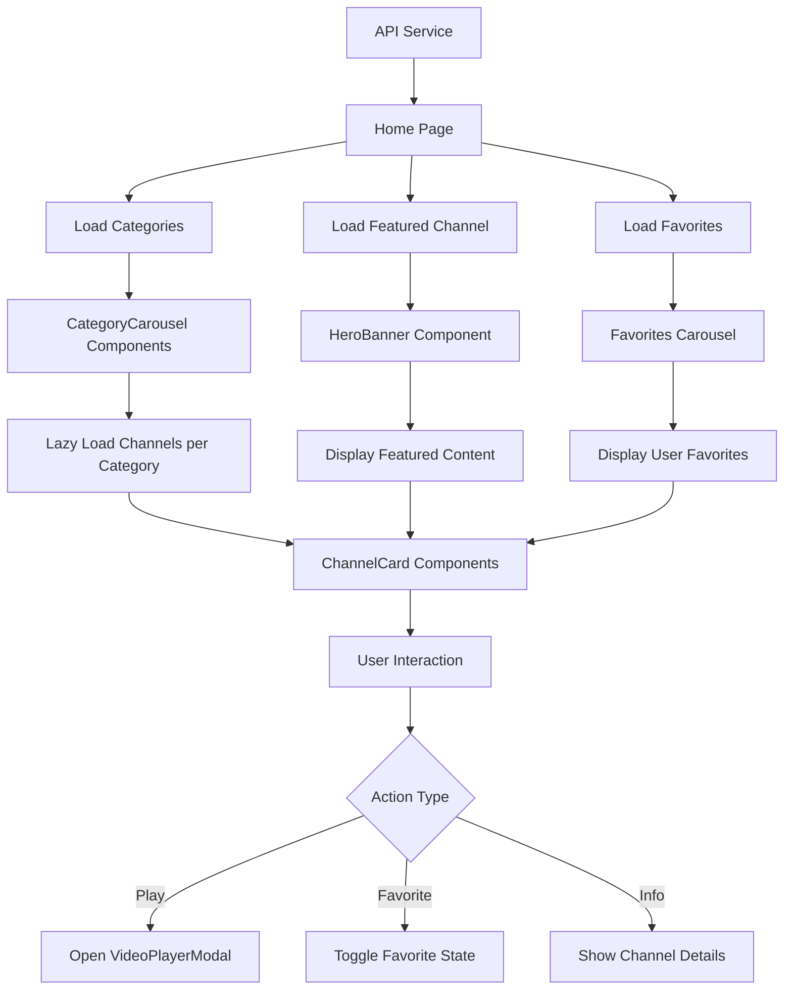

# Design Document - Netflix-Style UI Redesign

## Overview

Este documento descreve o design detalhado para transformar a aplicação M3U Platform em uma interface moderna inspirada na Netflix. O redesign foca em criar uma experiência visual imersiva, com navegação intuitiva através de carrosséis horizontais, hero banner destacado, tema dark elegante, e animações fluidas que elevam a experiência do usuário.

### Design Principles

1. **Content First**: O conteúdo visual (logos e thumbnails dos canais) deve ser o protagonista
2. **Minimal Friction**: Reduzir cliques necessários para assistir conteúdo
3. **Visual Hierarchy**: Hero banner → Favoritos → Categorias em ordem de relevância
4. **Smooth Interactions**: Todas as interações devem ter animações suaves e responsivas
5. **Dark Theme**: Interface escura que reduz fadiga visual e destaca o conteúdo

## Architecture

### Component Hierarchy

```
App
├── NetflixLayout (novo)
│   ├── NetflixHeader (novo)
│   │   ├── Logo
│   │   ├── Navigation
│   │   ├── SearchBar (expandível)
│   │   └── UserMenu
│   └── Main Content
│       ├── HeroBanner (novo)
│       ├── CategoryCarousel[] (novo)
│       │   ├── CarouselHeader
│       │   ├── CarouselContainer
│       │   │   ├── NavigationButton (left/right)
│       │   │   └── ChannelCard[] (novo)
│       │   │       ├── CardImage
│       │   │       ├── CardOverlay (hover)
│       │   │       └── CardActions
│       └── VideoPlayerModal (novo)
│           ├── VideoPlayer (atualizado)
│           └── ChannelInfo
```

### Data Flow



## Components and Interfaces

### 1. NetflixLayout Component

**Purpose**: Layout principal que substitui o DashboardLayout atual

**Props**:
```typescript
interface NetflixLayoutProps {
  children: React.ReactNode;
}
```

**Features**:
- Remove sidebar fixa
- Implementa header fixo com scroll behavior
- Background preto (#0a0a0a)
- Sem padding lateral para carrosséis full-width

**Styling**:
```css
.netflix-layout {
  background: #0a0a0a;
  min-height: 100vh;
  color: #ffffff;
}
```

---

### 2. NetflixHeader Component

**Purpose**: Header fixo com navegação e busca

**Props**:
```typescript
interface NetflixHeaderProps {
  transparent?: boolean; // Para hero banner
}
```

**Features**:
- Posição fixa no topo
- Background transparente com blur quando scrolled
- Transição suave de transparente para sólido
- Logo à esquerda
- Menu de navegação central
- Busca e perfil à direita

**States**:
```typescript
const [isScrolled, setIsScrolled] = useState(false);
const [searchOpen, setSearchOpen] = useState(false);
```

**Styling**:
```css
.netflix-header {
  position: fixed;
  top: 0;
  width: 100%;
  z-index: 100;
  transition: background-color 0.3s ease;
  padding: 1rem 4%;
}

.netflix-header.scrolled {
  background: rgba(10, 10, 10, 0.95);
  backdrop-filter: blur(10px);
}
```

---

### 3. HeroBanner Component

**Purpose**: Banner hero destacado com canal em destaque

**Props**:
```typescript
interface HeroBannerProps {
  channel: {
    id: string;
    name: string;
    display_name: string;
    logo_url?: string;
    category_name: string;
    stream_url: string;
    description?: string;
  };
  onPlay: (channel: Channel) => void;
  onMoreInfo: (channel: Channel) => void;
}
```

**Features**:
- Altura: 80vh
- Background: Imagem do canal com gradient overlay
- Informações do canal no canto inferior esquerdo
- Botões de ação: "Assistir" e "Mais Informações"
- Animação de fade-in ao carregar

**Layout**:
```
┌─────────────────────────────────────────┐
│                                         │
│         [Background Image]              │
│                                         │
│                                         │
│  ┌──────────────────────┐              │
│  │ Logo/Title           │              │
│  │ Category             │              │
│  │ Description          │              │
│  │                      │              │
│  │ [▶ Assistir] [ℹ Info]│              │
│  └──────────────────────┘              │
└─────────────────────────────────────────┘
```

**Styling**:
```css
.hero-banner {
  height: 80vh;
  position: relative;
  background-size: cover;
  background-position: center;
}

.hero-gradient {
  background: linear-gradient(
    to top,
    rgba(10, 10, 10, 1) 0%,
    rgba(10, 10, 10, 0.7) 50%,
    rgba(10, 10, 10, 0.4) 100%
  );
}

.hero-content {
  position: absolute;
  bottom: 35%;
  left: 4%;
  max-width: 500px;
}
```

---

### 4. CategoryCarousel Component

**Purpose**: Carrossel horizontal de canais por categoria

**Props**:
```typescript
interface CategoryCarouselProps {
  category: {
    id: string;
    name: string;
  };
  channels: Channel[];
  onChannelClick: (channel: Channel) => void;
  onLoadMore?: () => void;
}
```

**Features**:
- Scroll horizontal suave
- Botões de navegação (setas) nas laterais
- Lazy loading de canais
- Snap scroll para alinhamento
- Indicador de mais conteúdo

**States**:
```typescript
const [scrollPosition, setScrollPosition] = useState(0);
const [canScrollLeft, setCanScrollLeft] = useState(false);
const [canScrollRight, setCanScrollRight] = useState(true);
```

**Layout**:
```
┌─────────────────────────────────────────┐
│ Category Name                    [→]    │
├─────────────────────────────────────────┤
│ [←] [Card] [Card] [Card] [Card] [→]    │
└─────────────────────────────────────────┘
```

**Styling**:
```css
.category-carousel {
  padding: 0 4%;
  margin-bottom: 3rem;
}

.carousel-container {
  position: relative;
  overflow: hidden;
}

.carousel-track {
  display: flex;
  gap: 0.5rem;
  overflow-x: auto;
  scroll-behavior: smooth;
  scrollbar-width: none;
  -ms-overflow-style: none;
}

.carousel-track::-webkit-scrollbar {
  display: none;
}

.nav-button {
  position: absolute;
  top: 0;
  height: 100%;
  width: 4%;
  background: rgba(0, 0, 0, 0.5);
  z-index: 10;
  opacity: 0;
  transition: opacity 0.3s;
}

.carousel-container:hover .nav-button {
  opacity: 1;
}
```

---

### 5. ChannelCard Component

**Purpose**: Card individual de canal com hover effects

**Props**:
```typescript
interface ChannelCardProps {
  channel: Channel;
  onPlay: (channel: Channel) => void;
  onToggleFavorite: (channel: Channel) => void;
  isFavorite: boolean;
  size?: 'small' | 'medium' | 'large';
}
```

**Features**:
- Aspect ratio 16:9
- Hover: Scale 1.1 + elevação
- Overlay com informações e ações no hover
- Badge HLS/HD
- Ícone de favorito
- Transições suaves

**States**:
```typescript
const [isHovered, setIsHovered] = useState(false);
const [imageLoaded, setImageLoaded] = useState(false);
```

**Hover Behavior**:
```
Normal State:
┌──────────┐
│          │
│  [Logo]  │
│          │
└──────────┘

Hover State (Scale 1.1):
┌────────────┐
│   [Logo]   │
│            │
│ Title      │
│ Category   │
│ [▶] [♥]   │
└────────────┘
```

**Styling**:
```css
.channel-card {
  aspect-ratio: 16/9;
  border-radius: 4px;
  overflow: hidden;
  cursor: pointer;
  transition: transform 0.3s ease, box-shadow 0.3s ease;
  position: relative;
  min-width: 250px;
}

.channel-card:hover {
  transform: scale(1.1);
  box-shadow: 0 8px 24px rgba(0, 0, 0, 0.8);
  z-index: 20;
}

.card-overlay {
  position: absolute;
  inset: 0;
  background: linear-gradient(to top, rgba(0,0,0,0.9) 0%, transparent 50%);
  opacity: 0;
  transition: opacity 0.3s;
  display: flex;
  flex-direction: column;
  justify-content: flex-end;
  padding: 1rem;
}

.channel-card:hover .card-overlay {
  opacity: 1;
}
```

---

### 6. VideoPlayerModal Component

**Purpose**: Modal fullscreen para reprodução de vídeo

**Props**:
```typescript
interface VideoPlayerModalProps {
  channel: Channel | null;
  isOpen: boolean;
  onClose: () => void;
  onNextChannel?: () => void;
  onPrevChannel?: () => void;
}
```

**Features**:
- Fullscreen modal com backdrop escuro
- Player de vídeo integrado
- Informações do canal abaixo do player
- Botão de fechar (X)
- Navegação para próximo/anterior canal
- Sugestões de canais relacionados

**Layout**:
```
┌─────────────────────────────────────────┐
│ [X]                                     │
│                                         │
│         [Video Player]                  │
│                                         │
├─────────────────────────────────────────┤
│ Channel Title                           │
│ Category | HLS                          │
│ Description                             │
├─────────────────────────────────────────┤
│ Canais Relacionados                     │
│ [Card] [Card] [Card] [Card]            │
└─────────────────────────────────────────┘
```

**Styling**:
```css
.video-modal {
  position: fixed;
  inset: 0;
  z-index: 1000;
  background: rgba(0, 0, 0, 0.95);
  display: flex;
  flex-direction: column;
  overflow-y: auto;
}

.modal-content {
  max-width: 1400px;
  margin: 2rem auto;
  width: 90%;
}

.player-container {
  aspect-ratio: 16/9;
  background: #000;
  margin-bottom: 2rem;
}
```

---

### 7. SearchBar Component (Expandable)

**Purpose**: Barra de busca expansível no header

**Props**:
```typescript
interface SearchBarProps {
  onSearch: (query: string) => void;
  onResultSelect: (channel: Channel) => void;
}
```

**Features**:
- Estado colapsado: apenas ícone
- Estado expandido: input com sugestões
- Busca em tempo real (debounced)
- Dropdown com resultados
- Highlight do termo buscado

**States**:
```typescript
const [isOpen, setIsOpen] = useState(false);
const [query, setQuery] = useState('');
const [results, setResults] = useState<Channel[]>([]);
const [loading, setLoading] = useState(false);
```

**Styling**:
```css
.search-bar {
  transition: width 0.3s ease;
}

.search-bar.collapsed {
  width: 40px;
}

.search-bar.expanded {
  width: 300px;
}

.search-results {
  position: absolute;
  top: 100%;
  left: 0;
  right: 0;
  background: rgba(20, 20, 20, 0.95);
  backdrop-filter: blur(10px);
  border-radius: 4px;
  margin-top: 0.5rem;
  max-height: 400px;
  overflow-y: auto;
}
```

---

## Data Models

### Channel (Extended)

```typescript
interface Channel {
  id: string;
  name: string;
  display_name: string;
  logo_url?: string;
  stream_url: string;
  category_id: string;
  category_name: string;
  is_hls: boolean;
  description?: string; // Novo campo
  featured?: boolean; // Novo campo para hero banner
  view_count?: number; // Novo campo para ordenação
  created_at: string;
  updated_at: string;
}
```

### Category (Extended)

```typescript
interface Category {
  id: string;
  name: string;
  slug: string;
  display_order?: number; // Novo campo para ordenação customizada
  channel_count: number;
  created_at: string;
}
```

### ViewState

```typescript
interface ViewState {
  selectedChannel: Channel | null;
  playerOpen: boolean;
  searchOpen: boolean;
  searchQuery: string;
  heroChannel: Channel | null;
  categoriesWithChannels: Array<{
    category: Category;
    channels: Channel[];
    hasMore: boolean;
  }>;
}
```

---

## Error Handling

### Channel Loading Errors

```typescript
// Fallback para canais sem imagem
const ChannelPlaceholder = () => (
  <div className="channel-placeholder">
    <div className="placeholder-icon">
      <TvIcon />
    </div>
    <div className="placeholder-gradient" />
  </div>
);

// Erro ao carregar categoria
const CategoryErrorState = ({ onRetry }: { onRetry: () => void }) => (
  <div className="category-error">
    <p>Erro ao carregar canais desta categoria</p>
    <button onClick={onRetry}>Tentar novamente</button>
  </div>
);
```

### Stream Playback Errors

```typescript
// Integrado no VideoPlayerModal
const handleStreamError = (error: HlsError) => {
  if (error.fatal) {
    switch (error.type) {
      case 'networkError':
        showToast('Erro de conexão. Tentando reconectar...', 'warning');
        // Auto-retry logic
        break;
      case 'mediaError':
        showToast('Erro de mídia. Tentando recuperar...', 'warning');
        // Recovery logic
        break;
      default:
        showToast('Canal indisponível no momento', 'error');
        // Suggest alternative channels
    }
  }
};
```

---

## Testing Strategy

### Unit Tests

1. **Component Rendering**
   - ChannelCard renders correctly with/without image
   - CategoryCarousel renders with empty/populated data
   - HeroBanner displays featured channel info
   - SearchBar expands/collapses correctly

2. **User Interactions**
   - Card hover effects trigger correctly
   - Carousel navigation buttons work
   - Favorite toggle updates state
   - Search debouncing works

3. **State Management**
   - Player modal opens/closes
   - Search results update on query change
   - Favorites sync with backend

### Integration Tests

1. **Data Flow**
   - Categories load and populate carousels
   - Hero banner fetches featured channel
   - Favorites section updates on toggle
   - Search returns relevant results

2. **Navigation**
   - Clicking card opens player modal
   - Carousel scroll updates navigation buttons
   - Header transparency changes on scroll

### E2E Tests

1. **User Journeys**
   - Browse categories → Select channel → Watch stream
   - Search for channel → Play from results
   - Add to favorites → Access from favorites section
   - Navigate between channels in player modal

2. **Responsive Behavior**
   - Mobile: Touch scroll on carousels
   - Mobile: Hamburger menu navigation
   - Tablet: Adjusted card sizes
   - Desktop: Full carousel experience

---

## Performance Optimizations

### 1. Lazy Loading

```typescript
// Lazy load channels per category
const useCategoryChannels = (categoryId: string) => {
  const [channels, setChannels] = useState<Channel[]>([]);
  const [page, setPage] = useState(1);
  const [hasMore, setHasMore] = useState(true);

  const loadMore = useCallback(async () => {
    if (!hasMore) return;
    const newChannels = await getChannels({ categoryId, page, limit: 20 });
    setChannels(prev => [...prev, ...newChannels]);
    setHasMore(newChannels.length === 20);
    setPage(p => p + 1);
  }, [categoryId, page, hasMore]);

  return { channels, loadMore, hasMore };
};
```

### 2. Image Optimization

```typescript
// Progressive image loading
const ChannelImage = ({ src, alt }: { src: string; alt: string }) => {
  const [loaded, setLoaded] = useState(false);

  return (
    <div className="image-container">
      {!loaded && <Skeleton />}
       setLoaded(true)}
        className={loaded ? 'loaded' : 'loading'}
      />
    </div>
  );
};
```

### 3. Virtualization

```typescript
// Virtual scrolling para carrosséis com muitos itens
import { useVirtualizer } from '@tanstack/react-virtual';

const VirtualCarousel = ({ channels }: { channels: Channel[] }) => {
  const parentRef = useRef<HTMLDivElement>(null);

  const virtualizer = useVirtualizer({
    count: channels.length,
    getScrollElement: () => parentRef.current,
    estimateSize: () => 250,
    horizontal: true,
  });

  return (
    <div ref={parentRef} className="carousel-track">
      {virtualizer.getVirtualItems().map(virtualItem => (
        <ChannelCard
          key={virtualItem.key}
          channel={channels[virtualItem.index]}
          style={{
            transform: `translateX(${virtualItem.start}px)`,
          }}
        />
      ))}
    </div>
  );
};
```

### 4. Debouncing & Throttling

```typescript
// Search debouncing
const useDebounce = (value: string, delay: number) => {
  const [debouncedValue, setDebouncedValue] = useState(value);

  useEffect(() => {
    const handler = setTimeout(() => setDebouncedValue(value), delay);
    return () => clearTimeout(handler);
  }, [value, delay]);

  return debouncedValue;
};

// Scroll throttling
const useThrottle = (callback: Function, delay: number) => {
  const lastRun = useRef(Date.now());

  return useCallback((...args: any[]) => {
    if (Date.now() - lastRun.current >= delay) {
      callback(...args);
      lastRun.current = Date.now();
    }
  }, [callback, delay]);
};
```

---

## Accessibility

### Keyboard Navigation

```typescript
// Carousel keyboard navigation
const handleKeyDown = (e: KeyboardEvent) => {
  switch (e.key) {
    case 'ArrowLeft':
      scrollLeft();
      break;
    case 'ArrowRight':
      scrollRight();
      break;
    case 'Enter':
    case ' ':
      playChannel();
      break;
    case 'Escape':
      closeModal();
      break;
  }
};
```

### ARIA Labels

```html
<!-- Channel Card -->
<div
  role="button"
  tabIndex={0}
  aria-label={`Assistir ${channel.name}`}
  aria-pressed={isFavorite}
>
  <!-- Card content -->
</div>

<!-- Carousel -->
<div
  role="region"
  aria-label={`Canais da categoria ${category.name}`}
>
  <button
    aria-label="Rolar para esquerda"
    disabled={!canScrollLeft}
  >
    ←
  </button>
  <!-- Carousel content -->
  <button
    aria-label="Rolar para direita"
    disabled={!canScrollRight}
  >
    →
  </button>
</div>
```

### Focus Management

```typescript
// Trap focus in modal
const useFocusTrap = (isOpen: boolean) => {
  const modalRef = useRef<HTMLDivElement>(null);

  useEffect(() => {
    if (!isOpen) return;

    const modal = modalRef.current;
    if (!modal) return;

    const focusableElements = modal.querySelectorAll(
      'button, [href], input, select, textarea, [tabindex]:not([tabindex="-1"])'
    );

    const firstElement = focusableElements[0] as HTMLElement;
    const lastElement = focusableElements[focusableElements.length - 1] as HTMLElement;

    const handleTab = (e: KeyboardEvent) => {
      if (e.key !== 'Tab') return;

      if (e.shiftKey) {
        if (document.activeElement === firstElement) {
          lastElement.focus();
          e.preventDefault();
        }
      } else {
        if (document.activeElement === lastElement) {
          firstElement.focus();
          e.preventDefault();
        }
      }
    };

    modal.addEventListener('keydown', handleTab);
    firstElement?.focus();

    return () => modal.removeEventListener('keydown', handleTab);
  }, [isOpen]);

  return modalRef;
};
```

---

## Animation Specifications

### Timing Functions

```css
:root {
  --ease-in-out-cubic: cubic-bezier(0.65, 0, 0.35, 1);
  --ease-out-expo: cubic-bezier(0.16, 1, 0.3, 1);
  --ease-in-out-quart: cubic-bezier(0.76, 0, 0.24, 1);
}
```

### Keyframe Animations

```css
@keyframes fadeIn {
  from {
    opacity: 0;
    transform: translateY(20px);
  }
  to {
    opacity: 1;
    transform: translateY(0);
  }
}

@keyframes scaleIn {
  from {
    opacity: 0;
    transform: scale(0.9);
  }
  to {
    opacity: 1;
    transform: scale(1);
  }
}

@keyframes slideInFromLeft {
  from {
    opacity: 0;
    transform: translateX(-50px);
  }
  to {
    opacity: 1;
    transform: translateX(0);
  }
}

/* Apply animations */
.hero-banner {
  animation: fadeIn 0.8s var(--ease-out-expo);
}

.channel-card {
  animation: scaleIn 0.4s var(--ease-out-expo);
  animation-fill-mode: both;
}

.channel-card:nth-child(1) { animation-delay: 0.05s; }
.channel-card:nth-child(2) { animation-delay: 0.1s; }
.channel-card:nth-child(3) { animation-delay: 0.15s; }
/* ... */

.modal-content {
  animation: scaleIn 0.3s var(--ease-out-expo);
}
```

---

## Responsive Breakpoints

```typescript
const breakpoints = {
  mobile: '640px',
  tablet: '768px',
  laptop: '1024px',
  desktop: '1280px',
  wide: '1536px',
};

// Card sizes per breakpoint
const cardSizes = {
  mobile: 'w-[45%]',      // 2 cards visible
  tablet: 'w-[31%]',      // 3 cards visible
  laptop: 'w-[23%]',      // 4 cards visible
  desktop: 'w-[18%]',     // 5 cards visible
  wide: 'w-[15%]',        // 6 cards visible
};
```

---

## Color Palette (Netflix-Inspired)

```typescript
const colors = {
  // Backgrounds
  black: '#0a0a0a',
  darkGray: '#141414',
  mediumGray: '#2a2a2a',
  
  // Text
  white: '#ffffff',
  lightGray: '#b3b3b3',
  dimGray: '#808080',
  
  // Accents
  netflixRed: '#E50914',
  hoverRed: '#f40612',
  
  // Status
  success: '#46d369',
  warning: '#f9a825',
  error: '#f44336',
  
  // Overlays
  overlayDark: 'rgba(0, 0, 0, 0.7)',
  overlayLight: 'rgba(0, 0, 0, 0.4)',
};
```

---

## Implementation Notes

### Phase 1: Core Structure
- Implement NetflixLayout and NetflixHeader
- Create basic CategoryCarousel with static data
- Setup color palette and base styles

### Phase 2: Interactive Components
- Implement ChannelCard with hover effects
- Add carousel navigation and scroll behavior
- Create HeroBanner component

### Phase 3: Player Integration
- Build VideoPlayerModal
- Integrate existing VideoPlayer
- Add related channels section

### Phase 4: Search & Favorites
- Implement expandable SearchBar
- Create Favorites carousel
- Add real-time search functionality

### Phase 5: Polish & Optimization
- Add all animations and transitions
- Implement lazy loading and virtualization
- Optimize images and performance
- Add accessibility features
- Responsive design refinements
