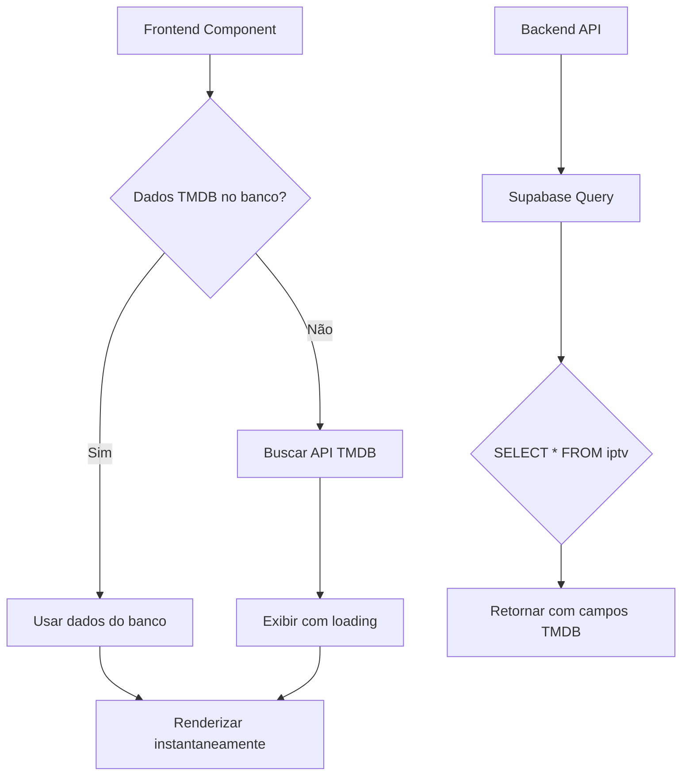

# Design Document

## Overview

Esta feature integra os metadados TMDB armazenados no banco de dados PostgreSQL/Supabase com o frontend React/Next.js. O design prioriza performance, usando dados do banco quando disponíveis e fazendo fallback para a API TMDB apenas quando necessário. A arquitetura mantém compatibilidade com o sistema existente enquanto adiciona capacidades avançadas de exibição de metadados.

## Architecture

### High-Level Flow



### Data Flow

1. **Backend → Frontend:**
   - Backend busca registros do Supabase incluindo todas as colunas TMDB
   - Dados são serializados e enviados via API REST
   - Frontend recebe objetos tipados com campos TMDB opcionais

2. **Frontend Rendering:**
   - Componentes verificam presença de dados TMDB
   - Se disponível: renderização imediata
   - Se não disponível: fallback para campos antigos ou busca TMDB

3. **Fallback Strategy:**
   ```
   tmdb_poster_path → logo_url → placeholder
   tmdb_vote_average → avaliacao → hide rating
   tmdb_overview → hide synopsis
   ```

## Components and Interfaces

### 1. Backend Types (`backend/src/clients/supabase.ts`)

```typescript
export interface ChannelRecord {
  // Campos existentes
  id: string;
  playlist_id: string;
  name: string;
  url: string;
  logo?: string;
  group_title?: string;
  language?: string;
  tvg_id?: string;
  raw_meta: Record<string, string>;
  is_hls: boolean;
  is_active: boolean;
  created_at: string;
  
  // Novos campos TMDB
  tmdb_id?: number;
  tmdb_title?: string;
  tmdb_original_title?: string;
  tmdb_overview?: string;
  tmdb_poster_path?: string;
  tmdb_backdrop_path?: string;
  tmdb_release_date?: string;
  tmdb_runtime?: number;
  tmdb_genres?: Array<{ id: number; name: string }>;
  tmdb_vote_average?: number;
  tmdb_vote_count?: number;
  tmdb_trailer_key?: string;
  tmdb_cast?: Array<{ name: string; character: string }>;
  tmdb_director?: string;
  tmdb_created_by?: Array<{ name: string }>;
  tmdb_number_of_seasons?: number;
  tmdb_number_of_episodes?: number;
  tmdb_last_sync?: string;
}
```

### 2. Frontend Types (`frontend/src/types/iptv.ts`)

```typescript
export interface ConteudoIPTV {
  // Campos existentes
  id: string;
  tipo: TipoConteudo;
  nome: string;
  nome_original?: string;
  categoria: string;
  url_stream: string;
  is_hls: boolean;
  is_active: boolean;
  
  // EPG (canais)
  epg_id?: string;
  epg_logo?: string;
  epg_numero?: string;
  
  // Séries
  temporada?: number;
  episodio?: number;
  nome_episodio?: string;
  
  // Imagens (campos antigos - manter para compatibilidade)
  logo_url?: string;
  backdrop_url?: string;
  
  // Estatísticas (campos antigos - manter para compatibilidade)
  visualizacoes: number;
  avaliacao?: number;
  
  // Controle
  created_at: string;
  updated_at: string;
  last_checked_at?: string;
  
  metadata?: Record<string, any>;
  
  // Novos campos TMDB
  tmdb_id?: number;
  tmdb_title?: string;
  tmdb_original_title?: string;
  tmdb_overview?: string;
  tmdb_poster_path?: string;
  tmdb_backdrop_path?: string;
  tmdb_release_date?: string;
  tmdb_runtime?: number;
  tmdb_genres?: Array<{ id: number; name: string }>;
  tmdb_vote_average?: number;
  tmdb_vote_count?: number;
  tmdb_trailer_key?: string;
  tmdb_cast?: Array<{ name: string; character: string }>;
  tmdb_director?: string;
  tmdb_created_by?: Array<{ name: string }>;
  tmdb_number_of_seasons?: number;
  tmdb_number_of_episodes?: number;
  tmdb_last_sync?: string;
}
```

### 3. Helper Functions

#### `getTMDBImageUrl` (já existe, manter)
```typescript
function getTMDBImageUrl(
  path: string | null, 
  size: 'w185' | 'w500' | 'original' = 'w500'
): string | null
```

#### `getPosterUrl` (novo)
```typescript
function getPosterUrl(item: ConteudoIPTV): string | null {
  if (item.tmdb_poster_path) {
    return getTMDBImageUrl(item.tmdb_poster_path, 'w500');
  }
  return item.logo_url || item.backdrop_url || null;
}
```

#### `getRating` (novo)
```typescript
function getRating(item: ConteudoIPTV): number {
  return item.tmdb_vote_average || item.avaliacao || 0;
}
```

#### `shouldFetchTMDB` (novo)
```typescript
function shouldFetchTMDB(item: ConteudoIPTV): boolean {
  if (!item.tmdb_id) return true;
  if (!item.tmdb_last_sync) return true;
  
  const lastSync = new Date(item.tmdb_last_sync);
  const daysSinceSync = (Date.now() - lastSync.getTime()) / (1000 * 60 * 60 * 24);
  
  return daysSinceSync > 30; // Atualizar se > 30 dias
}
```

### 4. Component Updates

#### `FilmeCard.tsx`

**Mudanças:**
- Usar `getPosterUrl()` para imagem
- Usar `getRating()` para avaliação
- Adicionar badge de ano (se `tmdb_release_date`)
- Adicionar badge de duração (se `tmdb_runtime`)
- Mostrar sinopse no hover (se `tmdb_overview`)

**Estrutura:**
```tsx
<div className="card">
  <div className="poster">
    <Image src={getPosterUrl(filme)} />
    {/* Badges */}
    {tmdb_release_date && <YearBadge />}
    {tmdb_runtime && <RuntimeBadge />}
    {getRating(filme) > 0 && <RatingBadge />}
  </div>
  
  <div className="info">
    <h3>{filme.tmdb_title || filme.nome}</h3>
    {tmdb_overview && <p className="synopsis">{truncate(tmdb_overview)}</p>}
  </div>
</div>
```

#### `SerieCard.tsx`

**Mudanças similares ao FilmeCard:**
- Usar `getPosterUrl()` e `getRating()`
- Adicionar badge de temporadas (se `tmdb_number_of_seasons`)
- Adicionar badge de episódios (se `tmdb_number_of_episodes`)

#### `MovieDetailsModal.tsx`

**Mudanças:**
- Verificar `shouldFetchTMDB()` antes de buscar API
- Se dados do banco são suficientes, não mostrar loading
- Usar dados do banco como fallback se API falhar

**Lógica:**
```typescript
useEffect(() => {
  if (!movie) return;
  
  // Se tem dados TMDB recentes no banco, usar direto
  if (movie.tmdb_id && !shouldFetchTMDB(movie)) {
    setTmdbData(movie); // Usar dados do banco
    setLoading(false);
    return;
  }
  
  // Caso contrário, buscar da API
  loadMovieData();
}, [movie]);
```

## Data Models

### Database Schema (já existe)

```sql
-- Tabela: iptv
-- Colunas TMDB já adicionadas via migration 20250116_add_tmdb_columns.sql

tmdb_id INTEGER
tmdb_title TEXT
tmdb_original_title TEXT
tmdb_overview TEXT
tmdb_poster_path TEXT
tmdb_backdrop_path TEXT
tmdb_release_date DATE
tmdb_runtime INTEGER
tmdb_genres JSONB DEFAULT '[]'::jsonb
tmdb_vote_average DECIMAL(3,1)
tmdb_vote_count INTEGER
tmdb_trailer_key TEXT
tmdb_cast JSONB DEFAULT '[]'::jsonb
tmdb_director TEXT
tmdb_created_by JSONB DEFAULT '[]'::jsonb
tmdb_number_of_seasons INTEGER
tmdb_number_of_episodes INTEGER
tmdb_last_sync TIMESTAMP WITH TIME ZONE
```

### API Response Format

```json
{
  "success": true,
  "data": [
    {
      "id": "uuid",
      "name": "Filme Exemplo (2024)",
      "url": "http://...",
      "logo": "http://...",
      "tmdb_id": 12345,
      "tmdb_title": "Filme Exemplo",
      "tmdb_poster_path": "/abc123.jpg",
      "tmdb_vote_average": 8.5,
      "tmdb_overview": "Sinopse do filme...",
      "tmdb_release_date": "2024-01-15",
      "tmdb_runtime": 120,
      "tmdb_genres": [
        {"id": 28, "name": "Ação"},
        {"id": 12, "name": "Aventura"}
      ],
      "tmdb_last_sync": "2025-01-16T10:30:00Z"
    }
  ],
  "meta": {
    "page": 1,
    "limit": 50,
    "total": 1000
  }
}
```

## Error Handling

### Estratégia de Fallback em Cascata

1. **Imagens:**
   ```
   tmdb_poster_path → logo_url → backdrop_url → placeholder
   ```

2. **Ratings:**
   ```
   tmdb_vote_average → avaliacao → hide rating badge
   ```

3. **Textos:**
   ```
   tmdb_title → nome
   tmdb_overview → hide synopsis
   ```

### Error States

1. **Dados TMDB ausentes:** Usar campos antigos silenciosamente
2. **API TMDB falha:** Usar dados do banco como fallback
3. **Imagem não carrega:** Mostrar placeholder com ícone
4. **Dados corrompidos:** Validar e sanitizar antes de renderizar

### Logging

```typescript
// Não logar erros para dados ausentes (esperado)
if (!item.tmdb_poster_path) {
  // Silencioso - usar fallback
}

// Logar apenas erros inesperados
try {
  const data = await fetchTMDB();
} catch (error) {
  console.error('Erro ao buscar TMDB:', error);
  // Usar dados do banco
}
```

## Testing Strategy

### Unit Tests

1. **Helper Functions:**
   - `getPosterUrl()` com diferentes combinações de dados
   - `getRating()` com valores null/undefined
   - `shouldFetchTMDB()` com diferentes datas

2. **Type Safety:**
   - Verificar que tipos compilam sem erros
   - Testar campos opcionais

### Integration Tests

1. **Backend API:**
   - Verificar que campos TMDB são retornados
   - Testar com registros com/sem dados TMDB
   - Validar formato JSON

2. **Frontend Components:**
   - Renderizar cards com dados completos
   - Renderizar cards com dados parciais
   - Renderizar cards sem dados TMDB

### E2E Tests (opcional)

1. Carregar página de filmes
2. Verificar que cards renderizam rapidamente
3. Abrir modal de detalhes
4. Verificar que não há chamadas desnecessárias ao TMDB

## Performance Considerations

### Otimizações

1. **Batch Loading:**
   - Backend retorna múltiplos registros em uma query
   - Frontend renderiza lista sem N+1 queries

2. **Image Optimization:**
   - Usar tamanhos apropriados (w185 para thumbnails, w500 para cards)
   - Lazy loading com Next.js Image component

3. **Caching:**
   - Dados do banco já são "cache permanente"
   - Cache IndexedDB continua funcionando para API TMDB

4. **Conditional Rendering:**
   - Não renderizar elementos se dados não disponíveis
   - Evitar re-renders desnecessários

### Métricas de Sucesso

- ✅ Redução de 90%+ em chamadas à API TMDB
- ✅ Tempo de carregamento de cards < 100ms
- ✅ Modal abre instantaneamente se dados no banco
- ✅ Zero erros de tipo em TypeScript

## Migration Strategy

### Fase 1: Backend (sem breaking changes)
1. Atualizar tipos TypeScript
2. Queries já retornam todos os campos (SELECT *)
3. Testar API

### Fase 2: Frontend Types (sem breaking changes)
1. Adicionar campos TMDB aos tipos
2. Código existente continua funcionando

### Fase 3: Components (gradual)
1. Atualizar FilmeCard
2. Atualizar SerieCard
3. Atualizar MovieDetailsModal
4. Testar cada componente isoladamente

### Fase 4: Cleanup (opcional)
1. Remover código não utilizado
2. Otimizar imports
3. Documentar mudanças

## Security Considerations

1. **Sanitização de Dados:**
   - Validar JSONB antes de renderizar
   - Escapar HTML em sinopses

2. **URLs de Imagem:**
   - Usar apenas domínios confiáveis (TMDB)
   - Validar formato de paths

3. **Rate Limiting:**
   - Manter rate limiting existente para API TMDB
   - Não aplicar rate limiting para dados do banco

## Rollback Plan

Se houver problemas:

1. **Reverter tipos:** Remover campos TMDB (breaking change)
2. **Reverter componentes:** Usar versão anterior dos arquivos
3. **Banco de dados:** Não precisa reverter (colunas podem ficar vazias)

Melhor estratégia: **Feature flags** para habilitar/desabilitar uso de dados TMDB.

---

**Design aprovado por:** [Aguardando aprovação]  
**Data:** 2025-01-16  
**Versão:** 1.0
